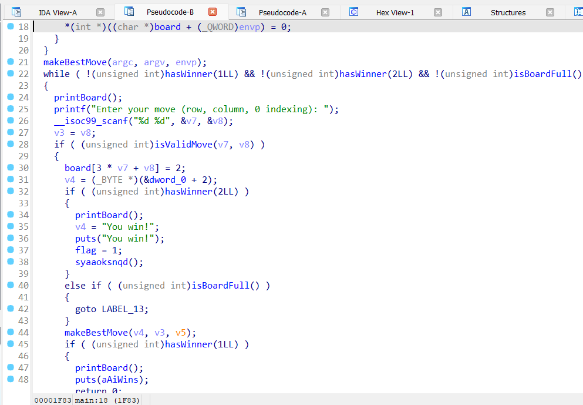
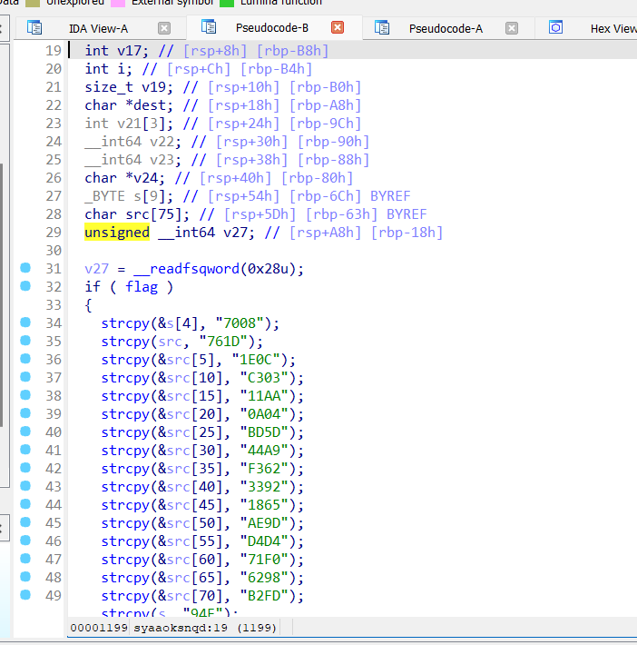
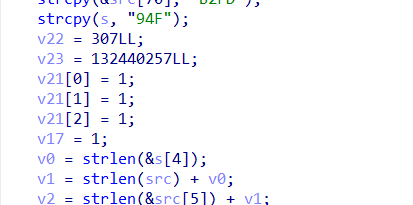
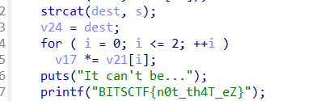

# Maxxing

Open the given minimax binary in IDA. From there in main you can see the specific function being called for the win





In this `syaaoksnqd` function at the end it just prints the red herring flag. But we can also see a hex being created. It is being made and copied into `dest` in the order provided and this gives 

`0x7008761D1E0CC30311AA0A04BD5D44A9F36233921865AE9DD4D471F06298B2FD94F`

If you look more in the function you can see two extra numbers here, an array of size of 3 and the same array of size 3 being multipled at the end.





`v22 : 0x133, v23 : 0x7E4E0C1`

So we can assume that there were supposedely three numbers that got multiplied in this win funciton. we have specifically three number.

```python
from Crypto.Util.number import long_to_bytes
a = 0x7008761D1E0CC30311AA0A04BD5D44A9F36233921865AE9DD4D471F06298B2FD94F
b = 0x133
c = 0x7E4E0C1

print(long_to_bytes(a * b * c))
```

`b'BITSCTF{w3_n33d_t0_st4rT_l0ok5m4Xx1nG}'`