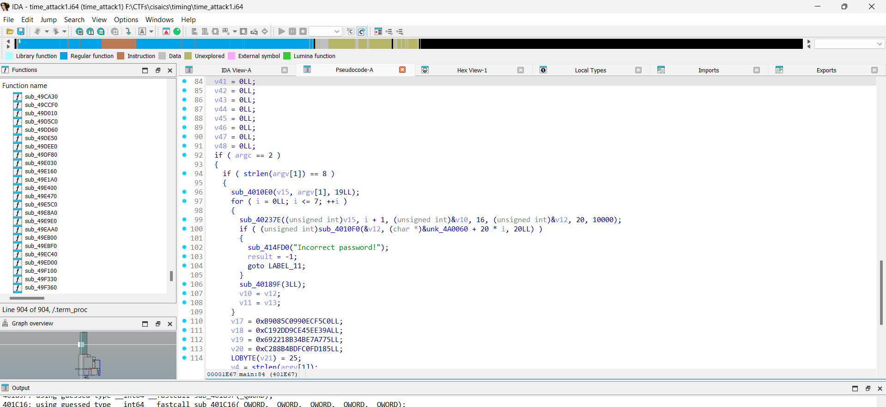
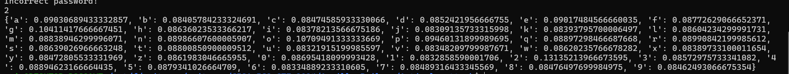
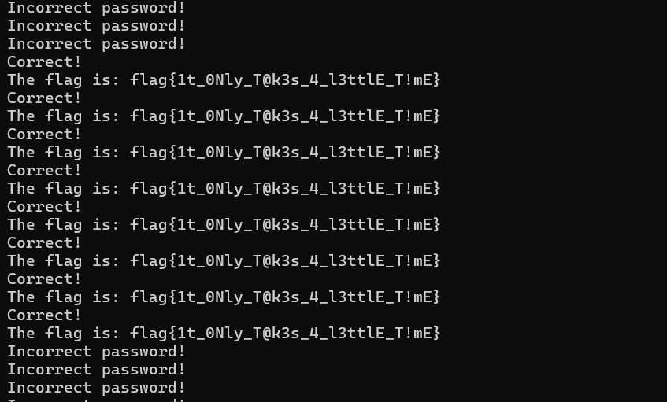

# A timely attack

## Challenge description

A Timely Attack

300

Anville Railway just had a long-term employee retire. They were in charge of keeping their internal inventory system up-to-date.

Now the maintenance team is trying to track down some of the backup equipment after a few power outages, but the inventory system needs some kind of password.

Attempts to contact the retiree failed and some things need to be replaced quickly.

Can you figure out the password?


There was a sticky note attached to the monitor. It read:
[a-z0-9]{4,10}

Flag format: Traditional CTF flag. Example: flag{th1s_1$_n0t_th3_fl@g}


## Challenge solution

Given a binary, reverse engineer the binary.



The binary is completely stripped plus no library attachment, this makes it hard for reversing the functions, but we can see after reversing and naming functions that there is a length check with size 8 for our program. 

By the description of the challenge and by looking at the code, the function will take each character and analyze it continously. So this means, each character will take a certain amount of time, if it is wrong, it will immedieatly exit. So this also means that if we get one character right it will start searching for the next character that will take longer, this means that by time we can detect if a character is correct or wrong. 

This is known as a [Timing Attack](https://en.wikipedia.org/wiki/Timing_attack).

Let's try this out dynamically, let's try using `subprocess` and python's `time.perf_counter()` which gives more accurate time count, to fuzz for one character. we are also given a regex so this will make our job easier. As a timing attack is not always a consistent attack, we will do each character 3 times and take their average. 

```py
import time
import subprocess
wordlist = 'abcdefghijklmnopqrstuvwxyz0123456789'
time_count = {}
for i in wordlist:
    current = []
    for _ in range(3):
        start_time = time.perf_counter()
        subprocess.run(['./time_attack1', i + '0' * 7])
        end_time = time.perf_counter()
        current.append(end_time - start_time)
    time_count[i] = sum(current) / len(current)
print(max(time_count, key=time_count.get))
print(time_count)
```


This shows our first character is `2` and now we have to just automate this process. 

Solve script:

```py
import time
import subprocess

wordlist = 'abcdefghijklmnopqrstuvwxyz0123456789'
password = ''
time_count = {}

for a in range(8):
    for i in wordlist:
        current = []
        for b in range(3):
            start_time = time.perf_counter()
            subprocess.run(['./time_attack1', password + i + '0' * (7 - len(password))])
            end_time = time.perf_counter()
            current.append(end_time - start_time)
        time_count[i] = sum(current) / len(current)
    char_found = max(time_count, key=time_count.get)
    print('char found: ', char_found)
    password += char_found

print(password)
subprocess.run(['./time_attack1', password])
```

During the last fuzz the flag appears



`flag{1t_0Nly_T@k3s_4_l3ttlE_T!mE}`