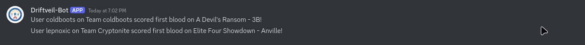

# Elite showdown : Anville

## Description

Marshal wants to test our your psychic cryptography capabilities before providing you his flag.

Marshal is using a SHA-1 secret-prefix HMAC for authentication SHA-1(key + message).

For instance, if his key was "\x63\x68\x61\x6e\x67\x69\x6e\x67\x5f\x73\x65\x63\x72\x65\x74\x5f\x6b\x65\x79\x21" (changing_secret_key!) and message was "super secret message", the SHA-1 HMAC would be:
SHA-1("changing_secret_key!super secret message") = 013fa8d0c73faacb43f09d6e1a29ec6f93d1159d

Marshal is constantly changing his key, but luckily all of his keys are always 20 characters/bytes long. 

Marshal's messages are always "mr.mime;espeon;bronzong;alakazam;", but he would like you to break his SHA-1 HMAC by sending him a new/forged message and HMAC without knowing the key.

Marshal requires the forged message you send him to contain both the original message "mr.mime;espeon;bronzong;alakazam;" and a new string ";gallade;".

If you reach out to Marshal at "0.cloud.chals.io" on port 28427 and provide him the password "crypto_fighting", he will give you his message and resulting HMAC and then ask you for your new/forged message. If your message contains the correct strings and the HMAC is verified against his key, he will provide you his secret key.

Good luck!

## Solution

The information indicates on a [length extension attack](https://en.wikipedia.org/wiki/Length_extension_attack) on the SHA-1 HMAC

We can use a tool like hashpump to do it. 

https://github.com/mheistermann/HashPump-partialhash

We download and build it, format both the input and output to the binary and let it's output be redirected to the netcat and it forges the required message correctly. 

```py
import pwn 

r = pwn.remote('0.cloud.chals.io', 28427)

r.sendlineafter(b'access this challenge: ', b'crypto_fighting')
r.recvuntil(b"Marshal's Message:  ")
given_message = r.recvline().strip().decode()
r.recvuntil(b"Marshal's HMAC:     ")
given_hmac = r.recvline().strip().decode()
p = pwn.process(['/media/akash/FILES/CTFs/cisaics/anville/HashPump-partialhash/hashpump', '-k', '20', '-d', given_message, '-s', given_hmac, '-a', ';gallade;'])


mask = p.recvline()
p.recvuntil(b'predicted sig: ')
predicted_sig = p.recvline().decode().strip()
predicted_msg = eval(b'"' + p.recvline().strip() + b'"')

print(predicted_sig, predicted_msg)

r.sendlineafter(b'Forged Message:', predicted_msg)
r.sendlineafter(b'Forged HMAC:', predicted_sig)

r.interactive()
```

`flag{h@d_t0_f1GHt_f0r_thiS_fl@g}`

we first blooded this 

