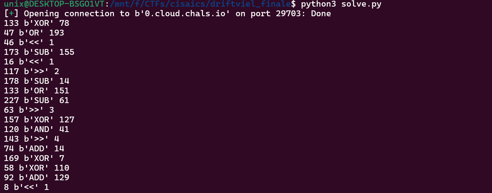
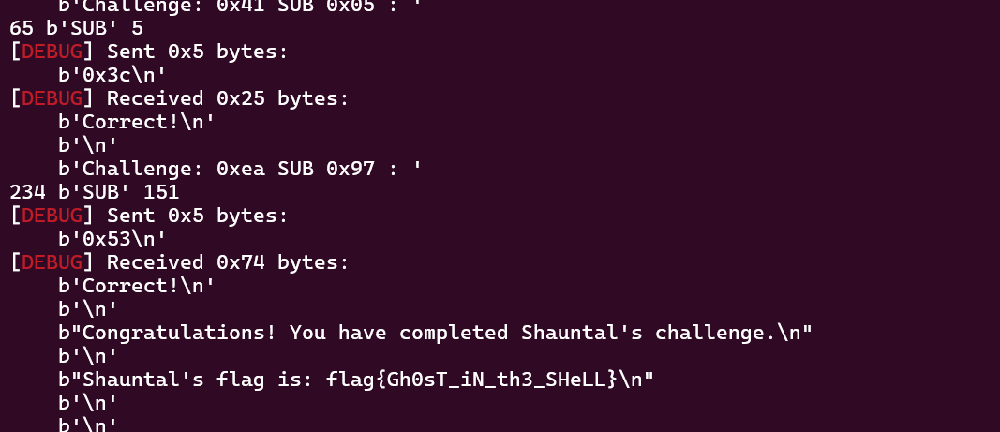

# Elite Showdown: Driftveil

## Description

In order for Shauntal to provide you her flag, she first wants you to answer some questions.

The good news is they are simple questions...the bad news is there are A LOT of them (hundreds).

All challenges contain binary operations and operands and answers are provided in hex. Shauntal is quite particular about her answers, and will only accept answers in hex with prefix 0x.

Examples:
* 0x05 = valid answer
* 0x5  = invalid answer
* 05   = invalid answer
* 5    = invalid answer

Shauntal's initial password for accessing her questions is "golurk" and she is waiting for you to reach out to her at "0.cloud.chals.io" on port 29703.

Answer all of Shauntal's questions correctly and she will give you her flag.

Good luck!

## Solution

netcat in and you see questions being asked continously about binary arthemetic. just make a script to brute

```py
from pwn import *

r = remote(b'0.cloud.chals.io', 29703)

r.sendlineafter(b'challenge: ', b'golurk')

def solve():
    r.recvuntil(b'Challenge: ')
    a, op, b = r.recvuntil(b' : ').split(b' : ')[0].split(b' ')

    print(int(a, 16), op, int(b, 16))

    if op == b'ADD':
        output = int(a, 16) + int(b, 16)
    elif op == b'SUB':
        output = int(a, 16) - int(b, 16)
    elif op == b'<<':
        output = int(a, 16) << int(b, 16)
    elif op == b'>>':
        output = int(a, 16) >> int(b, 16)
    elif op == b'AND':
        output = int(a, 16) & int(b, 16)
    elif op == b'XOR':
        output = int(a, 16) ^ int(b, 16)
    elif op == b'OR':
        output = int(a, 16) | int(b, 16)

    payload = f"0x{output:02x}".encode()

    r.sendline(payload)

while(True):
    solve()

r.interactive()
```




`flag{Gh0sT_iN_th3_SHeLL}`