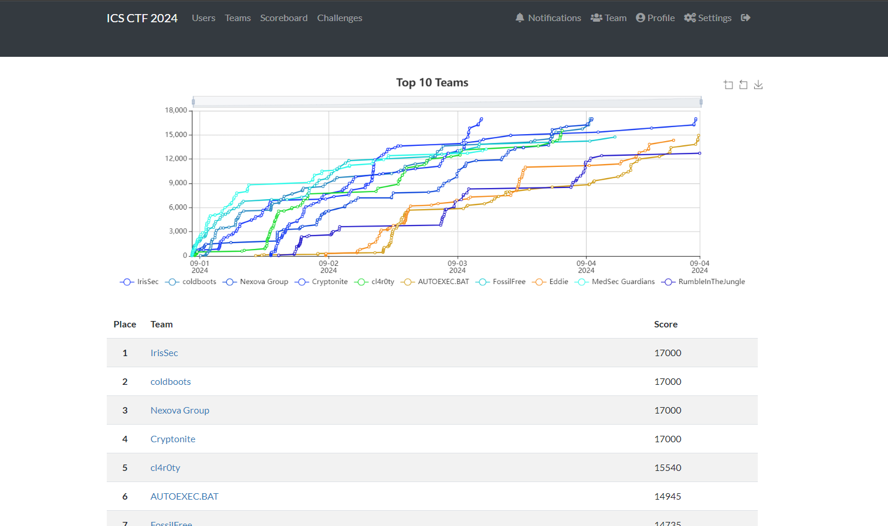

# CISA CTF 2024

Writeups for the ctf in which we finished all challenges and reached 4th position.

## CTF Introduction Challenge 

50 points

In this Capture the Flag event, you will be serving the role as an incident responder investigating various cyber incidents that occurred in the small city of Driftveil.

Driftveil Seal

This CTF is split into five main categories:

Security Foundations: introduction challenges that provide an introduction to Malcolm and an overview of basic ICS and security concepts

Driftveil City: Driftveil City is a small city on the coast and has been experiencing issues with their city infrastructure ICS protocols

Castelia Solutions: Castelia Solutions is the primary water-treatment facility for Driftveil and have been experiencing issues with their Historian and various embedded devices

Virbank Medical: Virbank Medical is the main hospital serving Driftveil and its surrounding towns and has been experiencing issues due to ransomware and poor cyber hygiene

Anville Railway: Anville Railway is a large rail-transport operating company headquartered in Driftveil and has been experiencing issues with their ICS network and devices

When solving challenges for these organizations, you and your team will be working alongside and assisting their engineers, technicians, IT, and security teams to investigate and remediate their cyber incidents. Each organization will have an introductory challenge to brief you on their situation and what they need your team's help with. The Security Foundations challenges serve as introductory-level challenges on various security and ICS concepts and are unrelated to the scenario.

Each company has provided network traffic to assist you in your investigation. All network traffic was taken on Thursday, June 20 2024 and has been ingested into Driftveil's security operations center's (SOC) Malcolm instance.

- Malcolm Homepage: https://malcolm.cisaicsctf.com/
- Malcolm Dashboards: https://malcolm.cisaicsctf.com/dashboards/
- Malcolm Arkime: https://malcolm.cisaicsctf.com/arkime/
- Malcolm Documentation: https://malcolm.cisaicsctf.com/readme/

- Username: analyst
- Password: Cyclic-Margarine9-Borax-Upfront

Each challenge will ask for a specific piece of information called a flag and will specify the format of that flag. Entering the correct flag will award you points and unlock the next challenge in that challenge line. To prevent guessing and brute forcing, each challenge has a limit on the number of flag submissions; if you have already made several incorrect guesses and are worried about continuing to submit solutions, please reach out to us for assistance before you reach the flag submission limit.

For additional CTF information and communication with the CTF administrators, join our Discord server: https://discord.gg/kGmQ6jDvWA

Alternatively, if you do not want to use Discord and have feedback/question about a challenge or CTF as a whole, you can email us at icsjwgctf@gmail.com

To get started on the CISA ICS CTF 2024, enter nuvema as the flag for this challenge!

Flag format: flag is nuvema