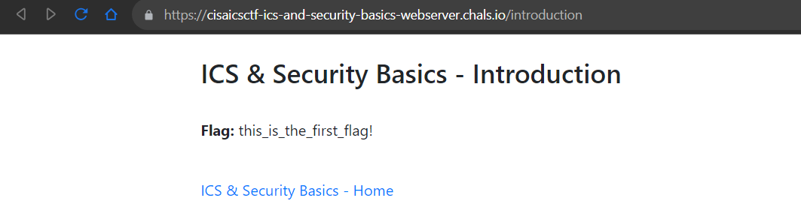
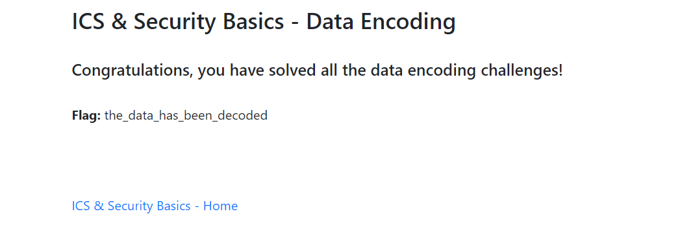

# ICS & Security Basics - Introduction

50 points

This challenge line contains five different challenge categories intended for contestants who are less familiar with Capture the Flag competitions.

All of the challenges in this challenge line can be solved using a web browser; no additional tools are required. We highly recommend using CyberChef (https://gchq.github.io/CyberChef/) for assistance solving these challenges.

Each ICS & Security Basics challenge category contains 4 different “mini-challenges.” After solving all “mini-challenges” in a category, you will be given a flag to enter for the corresponding challenge on the CTF server.

The flag for this introductory challenge is located at https://cisaicsctf-ics-and-security-basics-webserver.chals.io/introduction

Flag format: flag is located on website linked above. Example: if website shows "Flag: this_is_a_flag", the flag would be this_is_a_flag

# Solution

`this_is_the_first_flag!`

# ICS & Security Basics - Data Encoding

Computers encode data to convert it from one format into another. There are many ways computer systems utilize data encoding, and this series of challenges will introduce some of the most common data encoding formats: binary, decimal, hexadecimal, ASCII, and Base64.

The Data Encoding challenges can be found at: https://cisaicsctf-ics-and-security-basics-webserver.chals.io/data_encoding.

Flag format: flag will be provided after solving the series of challenges. Example: data_encoding_flag

## Solution

Some questions, convert binary to decimal to hex to ascii then decode base64 gives flag

