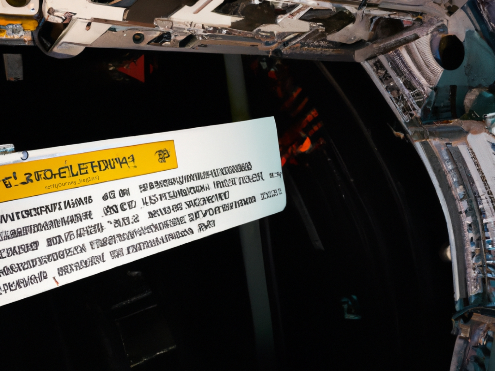

# Level 1: The Beginning

## Problem

The year is 2075. The United Nations Space Command has launched its ambitious deep space colonization mission, the starship Odysseus. Their destination is Terra Nova, an exoplanet orbiting Proxima Centauri, is located 4.25 light years away. With most of the crew and passengers in hibernation pods, the journey is expected to span over a century, propelled by rapid advancements in space travel. As the Vice-Captain of the mission, you too enter your hibernation pod, anticipating a wake-up call prior to the landing. However, fate takes an unexpected turn.
Halfway through the voyage, the ship's artificial intelligence, SPOCK, abruptly awakens you, only to discover that your hibernation pod is malfunctioning. Immersed in the dimly lit hibernation chamber, the ambient lighting emanates from a wall-mounted computer, casting a faint blue glow. Intricate status screens and blinking indicators adorn the walls, creating a mesmerizing display of scattered colored lights. Each step upon the smooth, reflective metal floor brings you closer to the enigmatic challenge that lies ahead. You need to find the override code and enter it on the computer screen to get out.

## Writeup

Looking at the figure closely we can see the flag near the yellow banner.

`sctf{j0urney_beg1ns}`