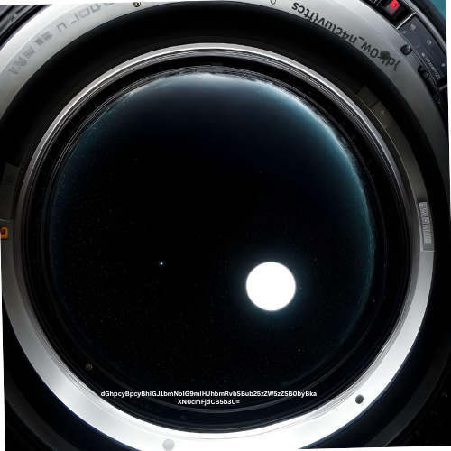
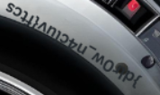

# Level 2: From Blasts to Time Warps

## Problem

Emerging from your malfunctioning pod, SPOCK delivers a grim briefing. Solar flares from a nearby star have ravaged the Odysseus, damaging vital systems and compromised radiation shields. Power relays are overloaded, locking out essential functions. Explosive blasts echo throughout the ship, deviating its trajectory. The captain lies unconscious on the bridge, a casualty of the chaos. The crew's fate hangs in uncertainty, demanding immediate action to regain control.

SPOCK informs you that there is one last resort you could try to return to the intended trajectory of the Odysseus, that is, using the time-travel module which has been dormant and untouched for decades. There are three steps for the same.

    Enabling the module
    Finding the correct timestamp where the ship was on the right trajectory
    Decrypting the code to open a wormhole to the past

To enter the time machine, you must first solve a puzzle. You go to the entrance of the time travel room and see that it is locked by a heavy metallic door. As you approach, your eyes fall upon the mysterious riddle etched onto the door's surface.

Tip: Keep track of where you are in your adventure
❕Hint: Every Question’s answer is in the format “ sctf{answer_to_the_puzzle} “. Find it somewhere inside the files attached below.

## Writeup

The below base64 is a bait

`dGhpcyBpcyBhlGJ1bmNoIG9mlHJbmRvbSBubZ5zZW5zZSB0byBkaXNDcmFjdCB5b3U=`

the actual flag is located above in reverse 

`sctf{vulc4n_w0rld}`