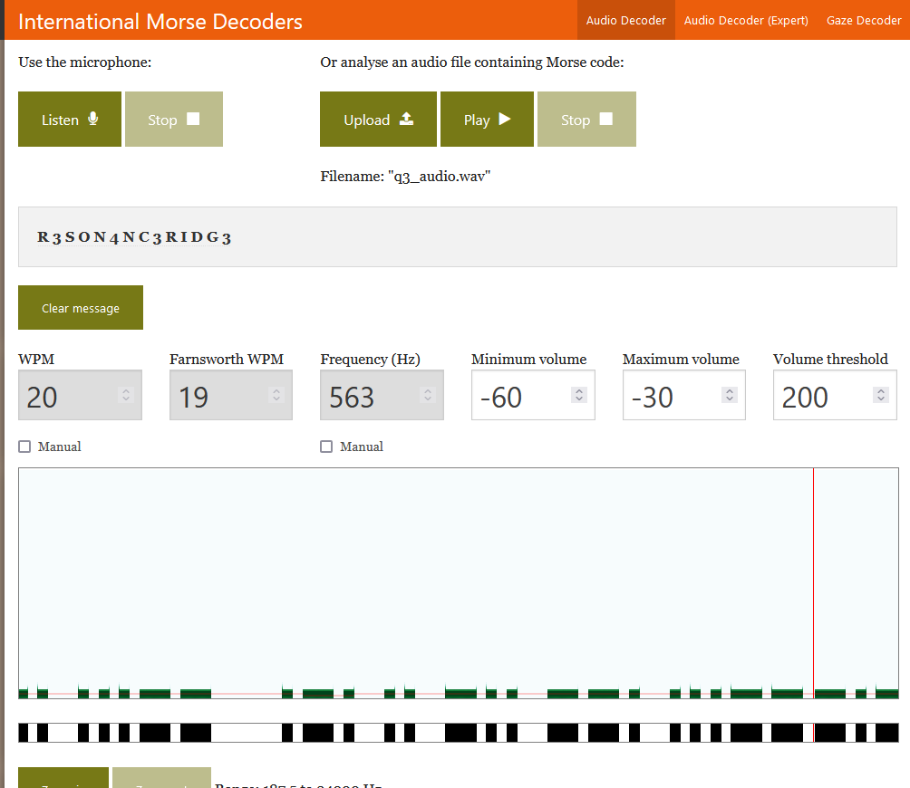

# Level 3: L1 Timegate

## Problem

You enter the dark command room only to hear continuous beeps. You search around the walls to find a light switch. In the flickering light, you see that the room looks dusty and moldy from years of abandonment. Standing in the middle of the room, you gather that the beeps aren’t as random as you thought, but rather repeat at regular intervals. You realize that deciphering this code might be the key to starting the machine. You ask SPOCK to record the beeps and he tells you that it sounds something like:
❕Hint: Put underscores in place of pause (i.e. between words) and use all lowercase.

## Writeup

Given audio is a morse code. Putting it into an online morse code decoder like [this](https://morsecode.world/international/decoder/audio-decoder-adaptive.html)

`sctf{r3son4nc3_ridg3}`