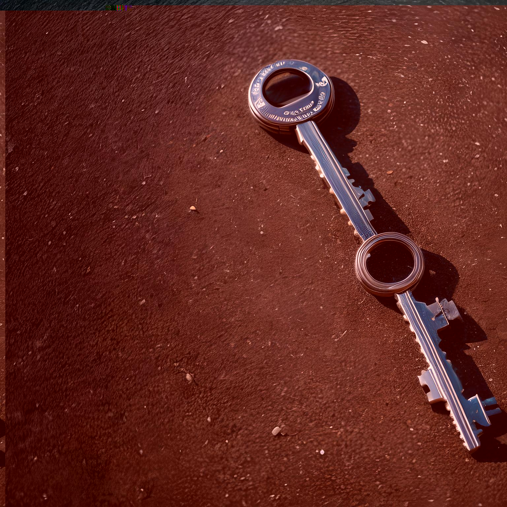

# Level 4: L2 Time Stamp

## Problem

Now that the wormhole initialiser has been fixed, SPOCK reminds you that you still require a timestamp to the past, a time before the solar flare occurred and the ship was on the right trajectory. SPOCK suggests downloading the data from the starship’s command module and extracting the correct timestamp by analysing the data.

Here's a hint for y'all:

"If you need the format it seems you are on the wrong path
but you should never dump thy hexes grab them close."

Look for THE time

Q4 Hints no. 2

Maybe there are strings inside images?




## Writeup

cat the jpeg, string it and search for the flag format

```
└─$ cat q4_timestamp.jpg | strings | grep sctf
sctf{5THJUNE2080}
```

`sctf{5THJUNE2080}`