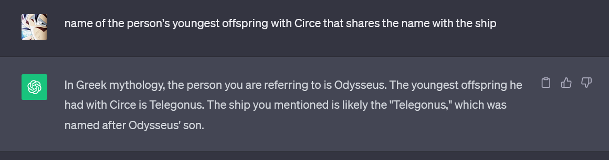

# Level 8: Robotic Arm

## Problem

The robotic arm to be used to install the new set of shields has forgotten the order of operation. The robotic arm can be fixed by checking the instruction manual or referring to the ship's maintenance logs.

## Writeup

Asking chatgpt about what might be the key



so the key is `TELEGONUS`. Now we xor the key to the length of the given string of bytes and decode it from base64

```python
from Crypto.Util.strxor import strxor
import base64
code = bytes([55, 119, 2, 117, 29, 33, 58, 44, 10, 12, 23, 38, 36, 0, 25, 126, 13, 97, 18, 48, 22, 3, 126, 37, 44, 18, 21, 33, 31, 125, 125, 119, 0, 10, 57, 106])
key = "TELEGONUS".encode("ascii")
key = key * (len(code)//len(key)) # Repeat key till the length of code
decode = strxor(code, key)
print(base64.b64decode(decode).decode("ascii"))
```

`sctf{ratchet_and_clang_489}`
