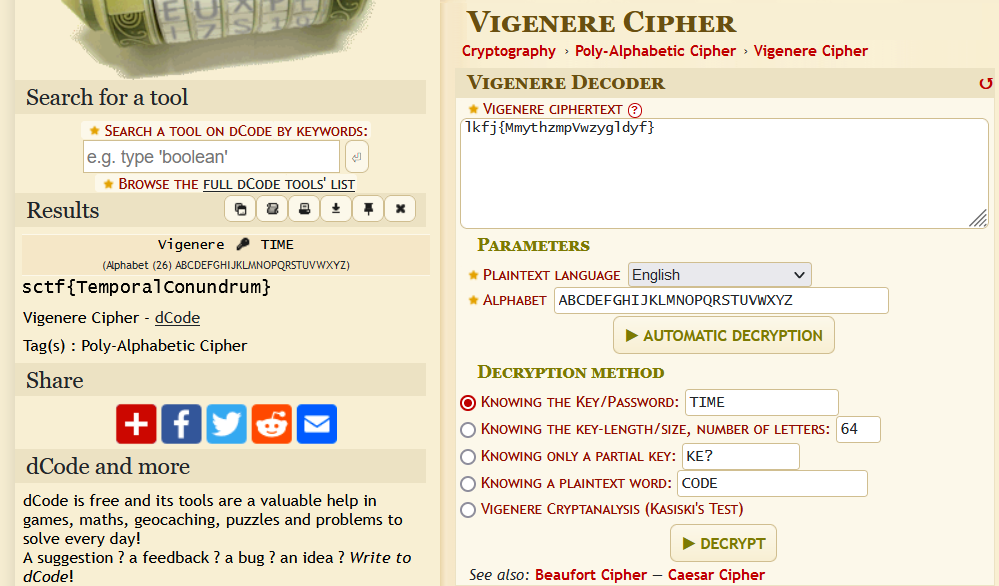

# Level 10: Fix Coms

## Problem

The communications dish has been damaged; this needs to be realigned in the direction of the headquarters. We don’t know the location of the communication array next to UNSC, but there are some engravings and an audio note on the ship’s database that point to the location. The recording however uses an outdated mode of communication. You need to decipher this and fix the communication systems.

## Writeup

We have another [BRAINFUCK](https://www.dcode.fr/brainfuck-language) message and a [morse code](https://morsecode.world/international/decoder/audio-decoder-adaptive.html). We decode the message to get the string `lkfj{MmythzmpVwzygldyf}`. And then we decode the audio file to get the string `TIMEISTHEKEYTHATYOUSEEK`. Meaning `TIME` is the key to the cipher given. After trail and searchings, it is found to be a [Vignere Cipher](https://www.dcode.fr/vigenere-cipher).

`sctf{TemporalConundrum}`