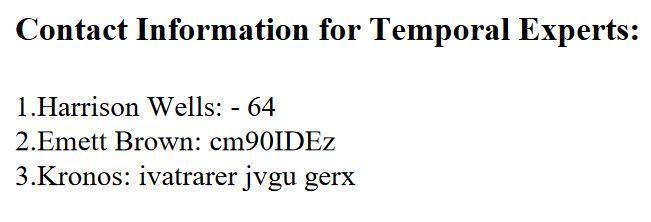
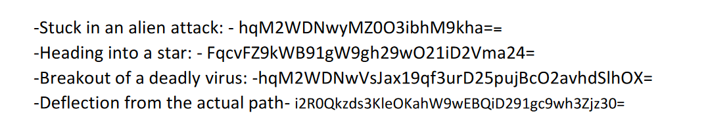

# Level 11: Send SOS

## Problem

You need to send an SOS signal to the UNSC. Consult the mission guidelines provided to find information about the right channel and encryption for sending an SOS signal to UNSC. Use the ship's communication system to select the correct channel and apply the specified encryption method to decipher the reply from UNSC.
❕Hint: Go through guidelines carefully and navigate even more carefully

## Writeup

In the given pdf there are 2 spots that stand out the most that can give valuable information.

First at the end



This is the Cipher steps that are being used.

The 64 means base64. Decoding the second part from base64 we get `rot 13` and deciphering the third part with rot 13 we get `viegenere with trek`. 

So our order of decipher is 1. Viegenere with trek, 2. ROT13, 3. Base64

Next the part before it 



Performing this cipher in all of the codes given here we get
```
never_let_you_go
fire_me_up_cool_me_down
never_back_down_never_give_up
sctf{sos_isnt_save_our_souls}
```
`sctf{sos_isnt_save_our_souls}`