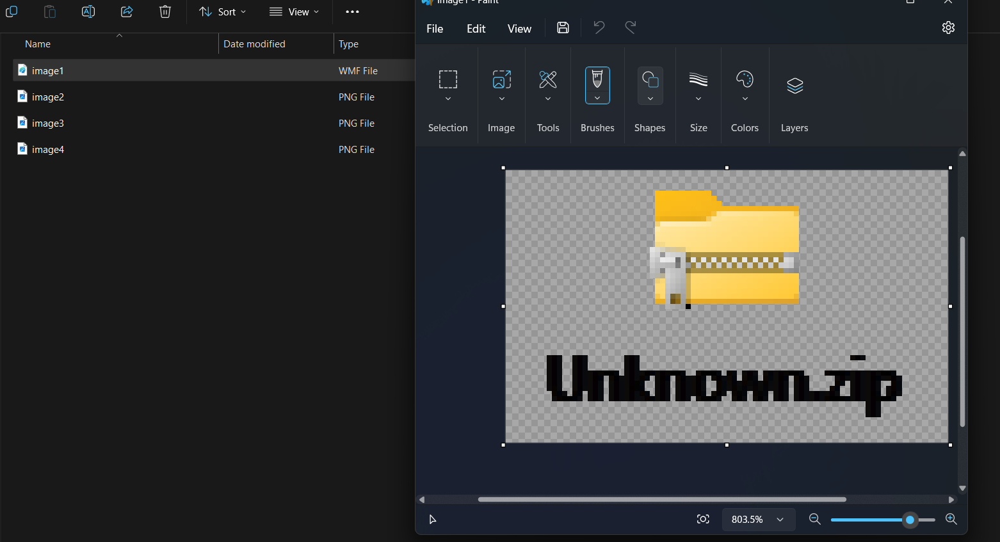

# Level 12: Location

## Problem

You need to study the decrypted file containing the map of your location and the surrounding planets. Analyse the distinctive features of each planet, such as colour, size, or unique landmarks, to help identify them.
❕Hint: Walking past the bin you find planets
❕flag format - sctf{flag_flag_flag}

## Writeup

We try to unzip the pptm file.
```
└─$ unzip planets.pptm
Archive:  planets.pptm
  inflating: [Content_Types].xml
  inflating: _rels/.rels
  inflating: ppt/presentation.xml
  inflating: ppt/_rels/presentation.xml.rels
  inflating: ppt/slides/slide1.xml
  inflating: ppt/slides/slide2.xml
  ...
└─$ ls -al
total 4968
drwxr-xr-x 5 user1 user1    4096 Nov 11 13:27  .
drwxr-xr-x 6 user1 user1    4096 Nov 11 13:27  ..
-rw-r--r-- 1 user1 user1    3452 Jan  1  1980 '[Content_Types].xml'
drwxr-xr-x 2 user1 user1    4096 Nov 11 13:27  docProps
-rw-r--r-- 1 user1 user1 5059561 Nov 11 13:13  planets.pptm
drwxr-xr-x 9 user1 user1    4096 Nov 11 13:27  ppt
drwxr-xr-x 2 user1 user1    4096 Nov 11 13:27  _rels
```
looking around we see that there is a hidden image in the media folder
```
┌──(user1㉿DESKTOP-565N39B)-[~/Scavenger hunt/planets/ppt]
└─$ ls
embeddings  presentation.xml  _rels         slideMasters  tableStyles.xml  viewProps.xml
media       presProps.xml     slideLayouts  slides        theme

┌──(user1㉿DESKTOP-565N39B)-[~/Scavenger hunt/planets/ppt]
└─$ cd media

┌──(user1㉿DESKTOP-565N39B)-[~/Scavenger hunt/planets/ppt/media]
└─$ ls
image1.wmf  image2.png  image3.png  image4.png
```


The image might be signifying of an existence of a hidden zip file. After a little more searching we see that in the embeddings folder there is a .bin file. We run binwalk on it.

```
┌──(user1㉿DESKTOP-565N39B)-[~/Scavenger hunt/planets/ppt/embeddings]
└─$ binwalk oleObject1.bin

DECIMAL       HEXADECIMAL     DESCRIPTION
--------------------------------------------------------------------------------
2374          0x946           Zip archive data, at least v2.0 to extract, name: Unknown/
2444          0x98C           Zip archive data, at least v2.0 to extract, uncompressed size: 329, name: Unknown/(22.156.93).txt
2671          0xA6F           Zip archive data, at least v2.0 to extract, uncompressed size: 576, name: __MACOSX/Unknown/._(22.156.93).txt
3128          0xC38           Zip archive data, at least v2.0 to extract, uncompressed size: 329, name: Unknown/(738.11.234).txt
3356          0xD1C           Zip archive data, at least v2.0 to extract, uncompressed size: 632, name: __MACOSX/Unknown/._(738.11.234).txt
3846          0xF06           Zip archive data, at least v2.0 to extract, uncompressed size: 329, name: Unknown/(566.23.178).txt
4065          0xFE1           Zip archive data, at least v2.0 to extract, uncompressed size: 632, name: __MACOSX/Unknown/._(566.23.178).txt
5283          0x14A3          End of Zip archive, footer length: 22
```

So we know now that this file is the Unknown.zip we have been looking for. 

```
┌──(user1㉿DESKTOP-565N39B)-[~/Scavenger hunt/planets/ppt/embeddings]
└─$ mv oleObject1.bin Unknown.zip

┌──(user1㉿DESKTOP-565N39B)-[~/Scavenger hunt/planets/ppt/embeddings]
└─$ unzip Unknown.zip
Archive:  Unknown.zip
warning [Unknown.zip]:  2374 extra bytes at beginning or within zipfile
  (attempting to process anyway)
   creating: Unknown/
  inflating: Unknown/(22.156.93).txt
  inflating: __MACOSX/Unknown/._(22.156.93).txt
  inflating: Unknown/(738.11.234).txt
  inflating: __MACOSX/Unknown/._(738.11.234).txt
  inflating: Unknown/(566.23.178).txt
  inflating: __MACOSX/Unknown/._(566.23.178).txt

┌──(user1㉿DESKTOP-565N39B)-[~/Scavenger hunt/planets/ppt/embeddings]
└─$ ls
__MACOSX  Unknown  Unknown.zip

┌──(user1㉿DESKTOP-565N39B)-[~/Scavenger hunt/planets/ppt/embeddings]
└─$ cd Unknown

┌──(user1㉿DESKTOP-565N39B)-[~/Scavenger hunt/planets/ppt/embeddings/Unknown]
└─$ ls
'(22.156.93).txt'  '(566.23.178).txt'  '(738.11.234).txt'

┌──(user1㉿DESKTOP-565N39B)-[~/Scavenger hunt/planets/ppt/embeddings/Unknown]
└─$ cat *
|--------------------------------------------|
| Pbybe: Enqvnag Ivbyrg                      |
| Fvmr: Fyvtugyl ynetre guna Rnegu           |
| Qvfgvapgvir Srngher: Gur Tyvggrevat Irvy   |
|--------------------------------------------|
| Anzr: Puebznnen                            |
|--------------------------------------------|
|--------------------------------------------|
| Pbybe: Rzrenyq Terra                       |
| Fvmr: Fznyyre guna Rnegu                   |
| Qvfgvapgvir Srngher: Gur Rgreany Sberfg    |
|--------------------------------------------|
| Anzr: Ireqnagben                           |
|--------------------------------------------|
|--------------------------------------------|
| Pbybe: Svrel Erq naq Benatr                |
| Fvmr: Ynetre guna Rnegu                    |
| Qvfgvapgvir Srngher: Gur Vasreab Pengre    |
|--------------------------------------------|
| Anzr: Vtavfnevn                            |
|--------------------------------------------|
```

ROT 13 this all text we get

```
|--------------------------------------------|
| Color: Radiant Violet                      |
| Size: Slightly larger than Earth           |
| Distinctive Feature: The Glittering Veil   |
|--------------------------------------------|
| Name: Chromaara                            |
|--------------------------------------------|
|--------------------------------------------|
| Color: Emerald Green                       |
| Size: Smaller than Earth                   |
| Distinctive Feature: The Eternal Forest    |
|--------------------------------------------|
| Name: Verdantora                           |
|--------------------------------------------|
|--------------------------------------------|
| Color: Fiery Red and Orange                |
| Size: Larger than Earth                    |
| Distinctive Feature: The Inferno Crater    |
|--------------------------------------------|
| Name: Ignisaria                            |
|--------------------------------------------|
```

now the order of the planets is the size order.

`sctf{Verdantora_Chromaara_Ignisaria}`