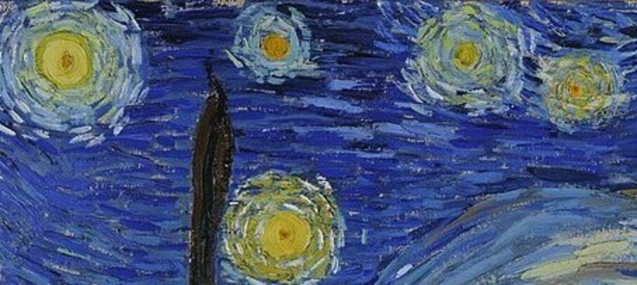
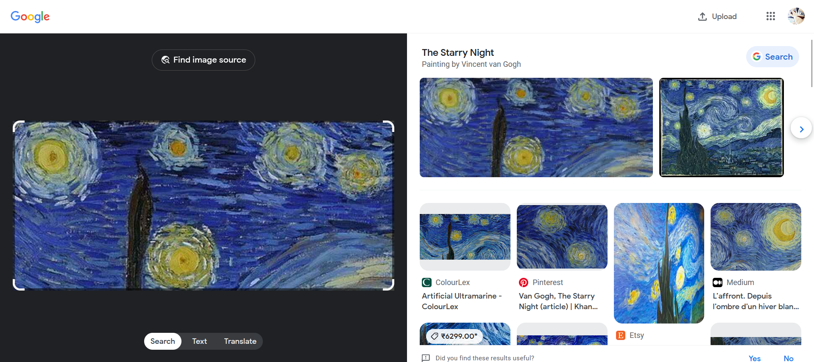
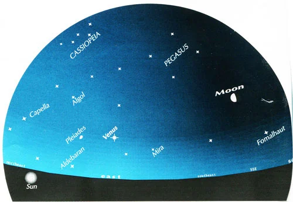

# Level 13: Location II

## Problem

The Navigation System has been severely damaged, which leaves you with the difficult task of retracing the route from the ship's current location to the far-off destination. You are given a map that covers the huge area of stars in the galaxy by the ever-ingenious SPOCK. You must now look out the window to locate recognizable constellations and other celestial features that will help you locate yourself in the universe.
❕Flag format is sctf{celestialbodyname} all in lowercase.

## Writeup

On doing a quick reverse image search, we find that this a part of a famous painting called "The Starry Night"

Googling "The starry night constellation" we get some results out of which we can find an image of the constellations in the painting

The photo's name is view from the window, so we can correlate that we are trying to view the part of the painting we have. So as we are given the top left most part of the painting, our constellation diagram is Cassiopeia.

`sctf{cassiopeia}`