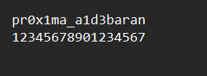

# Level 14: A Star

## Problem

You are back on track and now landing is necessary, you must find the star that is closest to Terra Nova. Finding the star that will guide you on your journey is your goal.
Hint:
Ilpq? Klqefkd fk vlro pfdeq?
64qe Yxpb zlria ebim vlr jfdeq
Pqfii qolryiba? Illh clo pfdkp,
Clrka qebj xcqbo, mrq kbt ifkbp

Reminder: Enclose the flag in sctf{}

## Writeup

We bruteforce the given hint in a rot cipher to get the a message

```
Lost? Nothing in your sight?
64th Base could help you might
Still troubled? Look for signs,
Found them after, put new lines
```
As all base64 characters end with `=` or `==` as padding, we can use this identify our required base64 lines in the big chunk of text we are given.

```python
import re
from base64 import b64decode
def find_and_print_alphanumeric(input_text):
    pattern = r'([a-zA-Z0-9]+[=]{1,2})'
    matches = re.findall(pattern, input_text)
    for match in matches:
        print(b64decode(match).decode("ascii"))
input_text = open("records.txt").readline()
find_and_print_alphanumeric(input_text)
```

```
There are 16 instructions excluding this one. 
The flag is 17 characters and two words long
Words are separated at position 8 with _
All the letters are lowercase  or numbers
Character at position 1 has ascii value 112
Character at position 7 9 14 16 is same 
Ascii of pos 11 is two more than ascii of pos 13 
Position 5 and 10 have number 1 
Character at position 4 is has ascii of 120
character at position 14 is  a 
Ascii of pos 2 is two more than ascii of pos 1
Increement char at pos 9 get char at pos 13
character at position 2 and 15 are same 
last character is position 17 that is n 
Decreement char at pos 17 get char at pos 6
Position 3 is number 0 position 12 is num 3
That is all you need, good luck to you !
```
After some manual labor, we get the flag



`sctf{pr0x1ma_a1d3baran}`