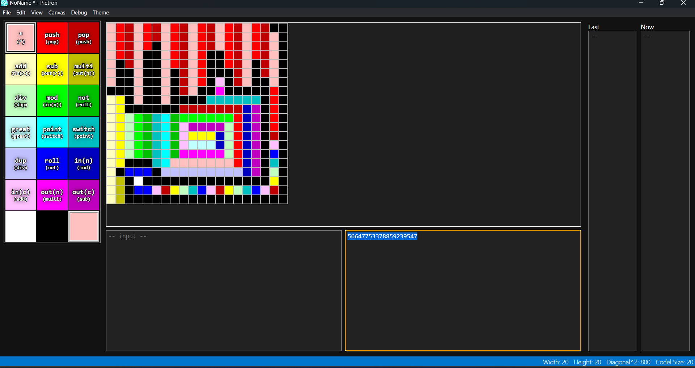
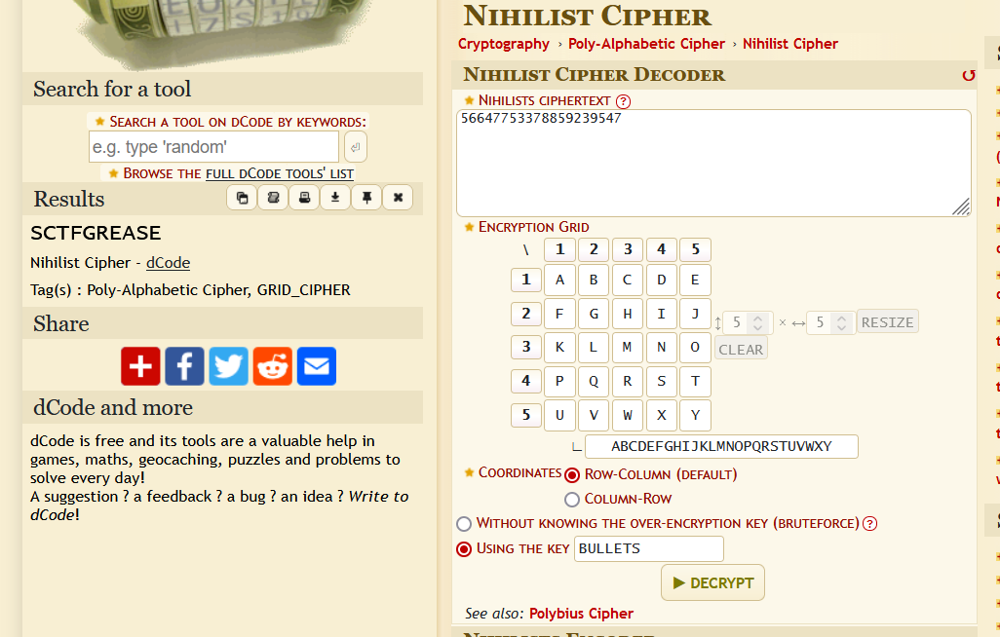

# Level 15: Landing Zone

## Problem

The clock is ticking as you solve the mystery of Terra Nova's precise landing coordinates. You try to determine where the Odysseus will triumphantly land on the exoplanet's pristine surface.
In order to do this you access the landing gear module which shows another image. Implemented by the ship’s engineer PIETro maximoff, the image has a hidden encoded message which can be deciphered by using the key which is just the plural word for what was used to kill him.
❕Enter flag in formant sctf{} all in lower case

## Writeup

To find the key, we google what killed pietro maximoff. The answer was he got shot in Avengers the age of Ultron. So `BULLETS` were used to kill him. 

Now we have a piet code in image. Sadly I couldn't find a interpreter that would take the image as input and run it without errors, so I downloaded a PIET editor called [PIETRON](https://github.com/dnek/pietron/). Recreating the whole code was manual labor.

We got the output from the code as `56647753378859239547`.

Given another text file with the name Nihilist with a table of alphabets means we are going to use Nihilist Cipher. So deciphering with the key we get the flag

`sctf{GREASE}`

