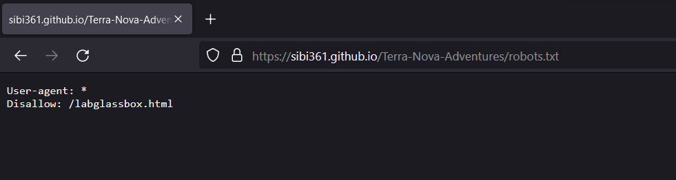
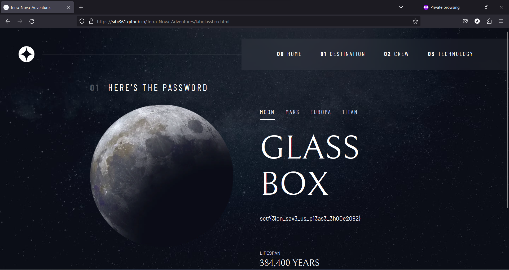

# Level 17: Access Resources

## Problem

The doors slide open, and you enter the town hall. You let your gut guide you as you look around both in awe and in search of something helpful. You enter a room with dimmed lighting. One of the walls is covered in hi-tech state-of-the-art technological devices, it appears to be the central system. You place your hand on one of the other walls and suddenly it starts glowing. It is not the wall, but symbols inscribed in it that brighten up the entire room. The wall shows in big letters “GO TO THE PAGES WHERE THE BLACK CAT LIVES. PS her name’s sibi361.github.io/Terra-Nova-Adventures/”.

You decipher that it’s a portal.
Now that the room is bright you notice a glass box in the room, in which lies a book. The box is password-protected and the keypad has symbols similar to those on the wall. You know exactly what to do so you waste no time and start decoding the wall.

## Writeup

Given a website, opening it we have a normal webpage. Checking robots.txt.

`sctf{3lon_sav3_us_p13as3_3h00e2092}`