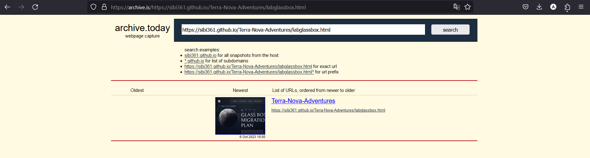
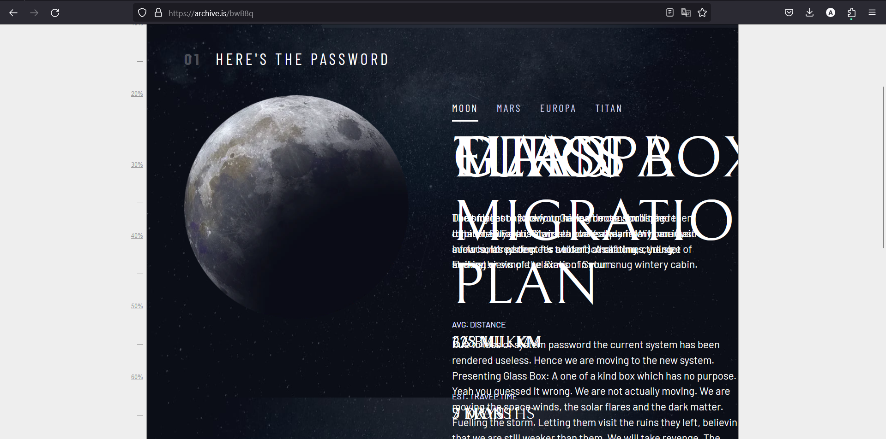
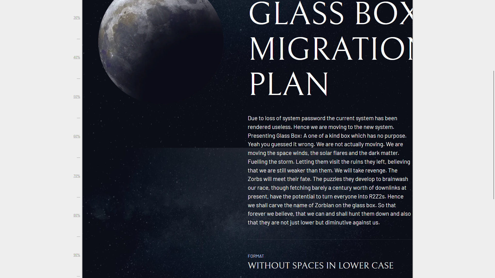
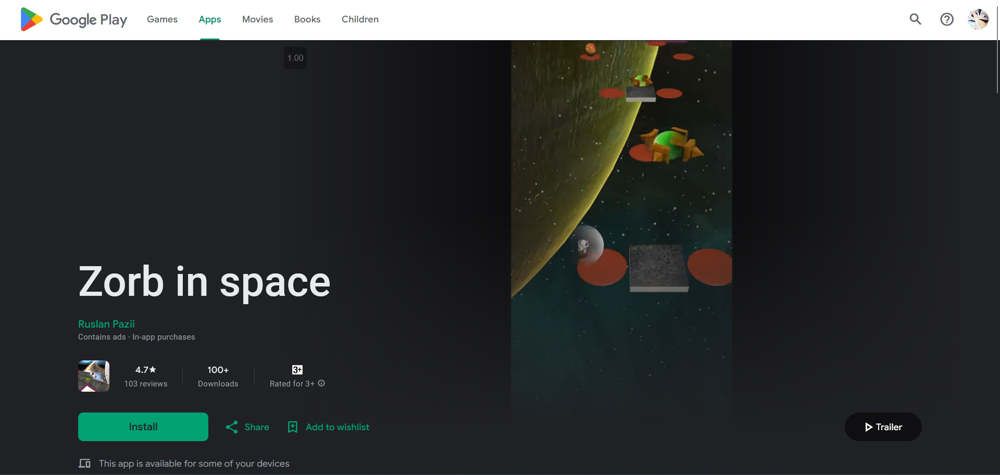

# Level 18: Decoding Wall

## Problem

With the book in your hands, you’re not exactly sure what to do with it. You open it and yet again it is filled with symbols which you now realise is probably the language of this planet. The book isn’t completely useless though, it has diagrams too, similar to those in a user manual. You stop wasting your time with the book and decide to have a look at the central system. You turn on the main switch, but the system seems to be malfunctioning.
You start panicking hoping you haven’t caused permanent damage to any important data. You try all the regular things that we do when a computer malfunctions, and with no hope left you start looking for answers but your knowledge seems to be wasted here. So you turn back to the portal on the wall. What if the oracle where you found the password contained more than just the password. Maybe it contains more? Maybe you didn’t look hard enough. Or maybe you just got to travel back in time! 384,400 years? And remember Master Ooglway is always by your side at play mall.

Hint Lets visit Master Ooglway's play mall
afterall puzzles are games right and its a space adventure
its time to "zorb"

## Writeup

We are told to use the earlier website for more stuff. As we are refernced a lot about time travel, this is a good reference to the way back machine. Though we had to search up different way back machines until we stumbled upon archive.is

After deleting some divs

<pre>
Glass Box Migration Plan 

Due to loss of system password the current system has been rendered useless. Hence we are moving to the new system. Presenting Glass Box: A one of a kind box which has no purpose. Yeah you guessed it wrong. We are not actually moving. We are moving the space winds, the solar flares and the dark matter. Fuelling the storm. Letting them visit the ruins they left, believing that we are still weaker than them. We will take revenge. The Zorbs will meet their fate. The puzzles they develop to brainwash our race, though fetching barely a century worth of downlinks at present, have the potential to turn everyone into R2Z2s. Hence we shall carve the name of Zorbian on the glass box. So that forever we believe, that we can and shall hunt them down and also that they are not just lower but diminutive against us. 

Format without spaces in lower case
</pre>

At this point we had to queue in for some hints when we got this.

After the hint we can see that master ooglway refers to google play and we are searching for a game that has 100 downloads that is related to zorb. So after googling we find out an app called [Zorb In Space](https://play.google.com/store/apps/details?id=com.paziiruslan.zorbinspace) that also has 100 downloads.

So our flag is the developer's name

`sctf{ruslanpazii}`