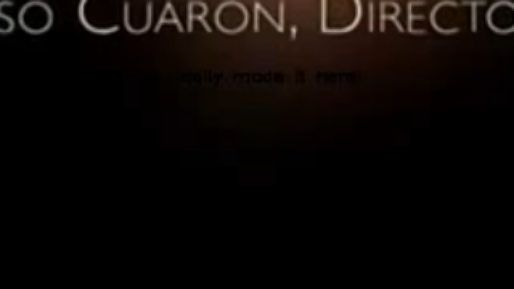
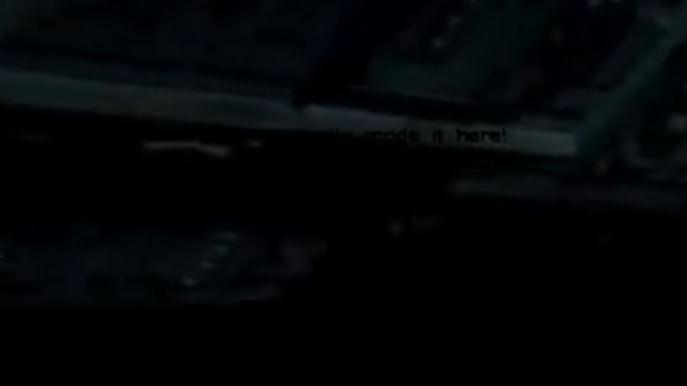

# Level 19: Computer

## Problem

Now that the computer system is fixed, SPOCK tells you that he is unable to access the files. It turns out that the computer system has been locked so that the knowledge on it does not fall into the wrong hands. Luckily, SPOCK has found a collection of files in one of the older hard drives, use these to access the system.
Hint: Darkness serves as a backdrop for the brilliance of light.

Hints: 
1) try getting between 69
2) For those in Q19, we are very glad you have come this far.
Great Job. You finally made it here!
Things will not get easier.

## Writeup

This would have been tough without the hints but by the time we reached this level we had got the hints. 

So by the first hint we know that we have to look in our message video between the 6th and 9th seconds. And we can see in black text a message is written.




closely looking we can make the words "finally made it here" but that's it. But knowing that and seeing the second hint, we can deduce the message is `Great Job. You finally made it here!`.

Now analyzing the given challenge.py and output.txt, we can see a Cipher being used called ARC4. After searching we find out that it is also just another XOR encryption but with a key. We have 1 decipher and 2 cipher to work with. 

After searching for some method to crack for a key, i found this crypto stackexchange article https://crypto.stackexchange.com/questions/45021/rc4-finding-key-if-we-know-plain-text-and-ciphertext that showed that you don't need a key for just the decipher, you can just xor all 3 of them. So we strxor all 3 of the strings.

```python
from Crypto.Util.strxor import strxor
from binascii import unhexlify
hex_data = "5a8bf3f7e01a00e7ee83180cd8eb61cfa90ef9e99e0f627ce02d86371bd75b94232109f3"
hex_data_2 = "6e9ae2f0ef6e25ffe2f27034dbf21efaa503edf797290179e839bc5611c01e8f35615daf"
msg = bytes("Great Job. You finally made it here!", "utf-8")

output = unhexlify(hex_data.encode())
output_2 = unhexlify(hex_data_2.encode())
final_output = strxor(strxor(output, output_2), msg)
print(final_output.decode())
```

`sctf{Town_Hall_Secure_Chip_Access21}`