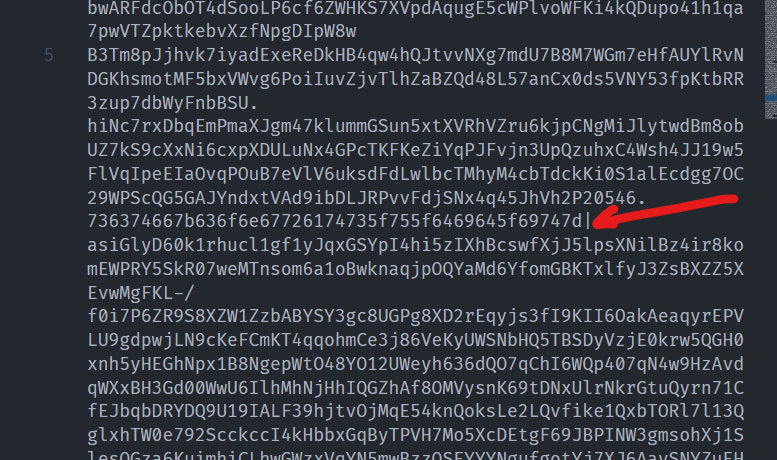

# Level 20: Backdoor

## Problem

Upon getting access to the system, you discover that the civilization that inhabited Terra Nova was attacked by an alien race called the Zorbs. They had lived in peace for millennia and the invasion blindsided them. Their cities were decimated and survivors went missing. The Zorbs salvaged most of the technology on the planet but their most advanced innovations were hidden away by the leaders of the civilization making their last stand. The computer in the Town Hall recognizes your non-hostile intentions and allows you to access some sensitive files to help your quest. The computer system also gives you the coordinates of an unknown entity. You immediately head back to Odysseus and fly off to these coordinates.
Upon reaching the destination, you find yourself in the countryside, by the side of a mountain. You look around and find a metal door hidden in plain sight. Upon inspection, you find that the door is sealed shut. SPOCK tells you that there must be something in the files you accessed at the Townhall computer that would help us open the door.

## Writeup

I still don't know what is the intended way for this. So I performed the faster way i guess. We are given a html and text file. The first text box in the html file says to search for hex encoded string. My brain immedieatly thought of searching a hex string than something that was obvious and coincidentally while scrolling i found an odd one out hex string



I decoded it......... and i got the flag

`sctf{congrats_u_did_it}`

Post analysis. I still don't know what was the intended method to reach there but I did continue to dig deep and found 2 interesting things. First being there was an ascii array there which i didn't even see, which i tried to decode which gave a hex string

`53:56:54:99:53:52:52:101:55:53:52:49:52:52:52:100:55:53:54:51:55:97:52:101:52:102:54:99:53:52:52:101:55:53:52:57:53:52:52:101:55:53:54:55:55:97:52:100`

`586c544e7541444d75637a4e4f6c544e7549544e75677a4d`

The next thing was I checked the html code to find a function that reverse a cipher string, and there were two ciphers in the html code itself. So i tried to decode them to see what they were

```javascript
function f(h) {      
    const g = h.split(';');
    g.pop();
    const i = g.map(function(number) {
        const j = parseFloat(number) * 2;
        return String.fromCharCode(j);
    }).join('');
    return i;
};
console.log(f("39;32.5;41.5;32.5;"));
console.log(f("33.5;54;55.5;57.5;50.5;16;29;20.5;16;44.5;55.5;58.5;16;55;50.5;50.5;50;16;58;55.5;16;40;36.5;39;16;52.5;58;16;50;55.5;59.5;55;16;54.5;55.5;57;50.5;23;16;"));
```
That gave output `NASA` and `Close :) You need to PIN it down more.` So basically I got the initial responeses I was supposed to give to the form. I tried giving them and sure enough I got this message which I decoded. Though I don't know what it means or how are we supposed to reach to the flag.