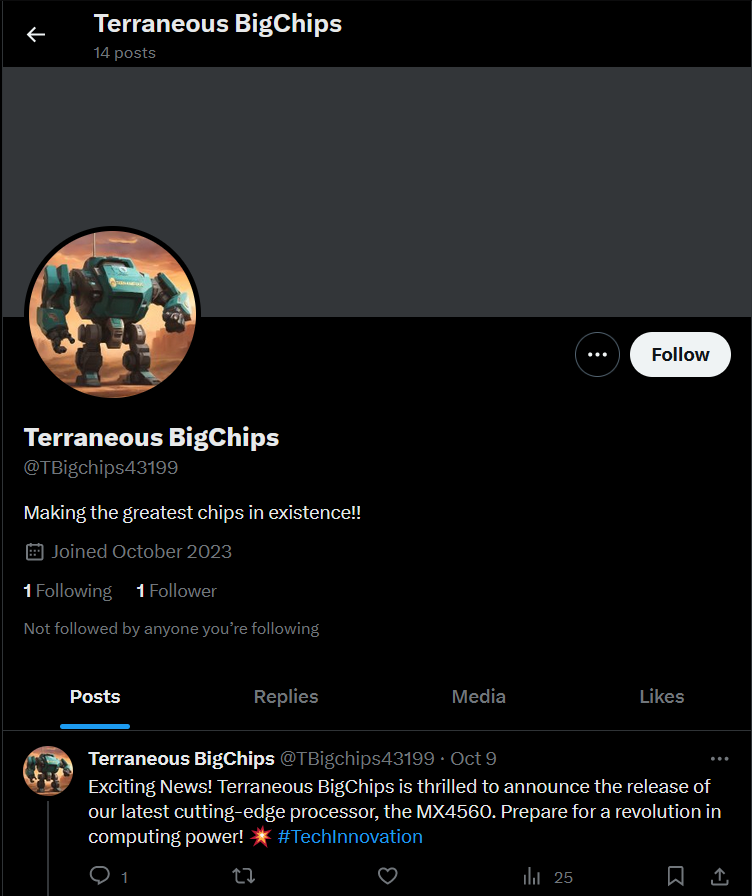
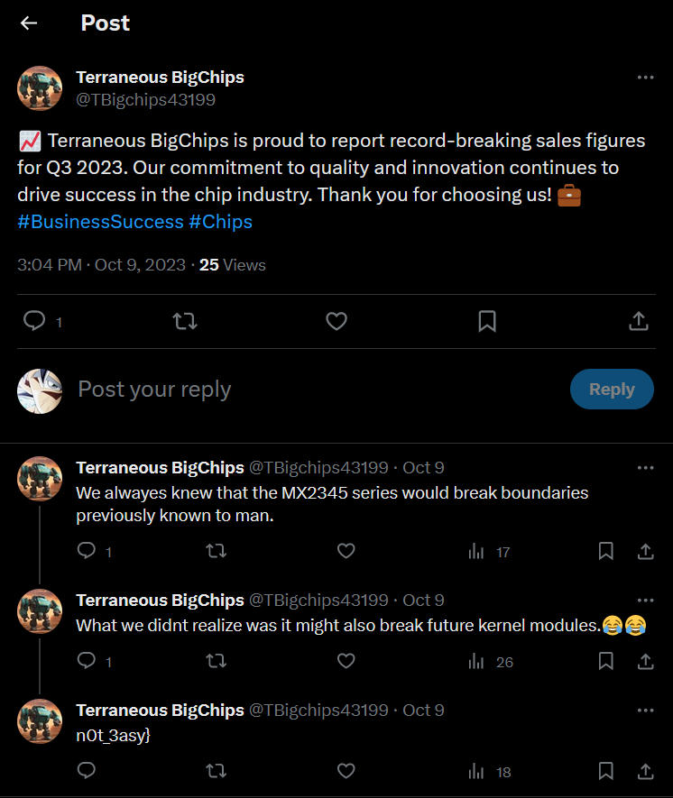
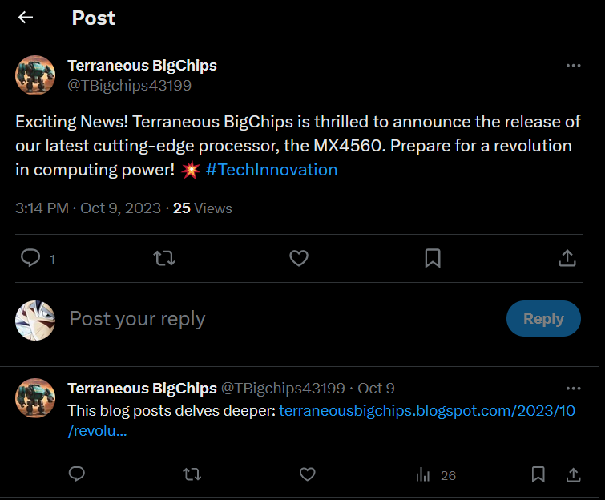
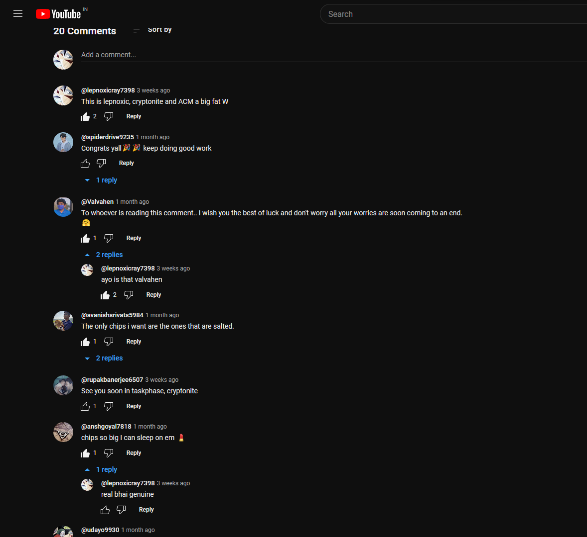
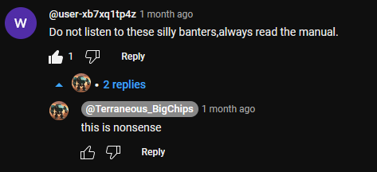
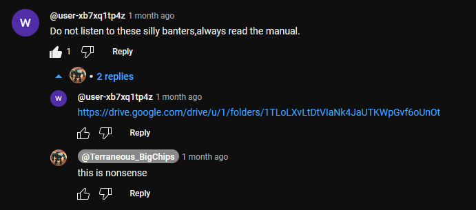
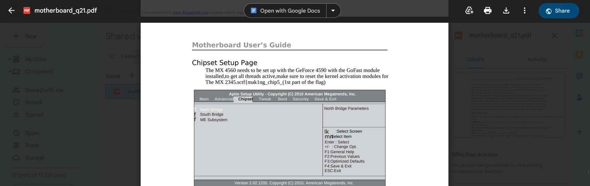
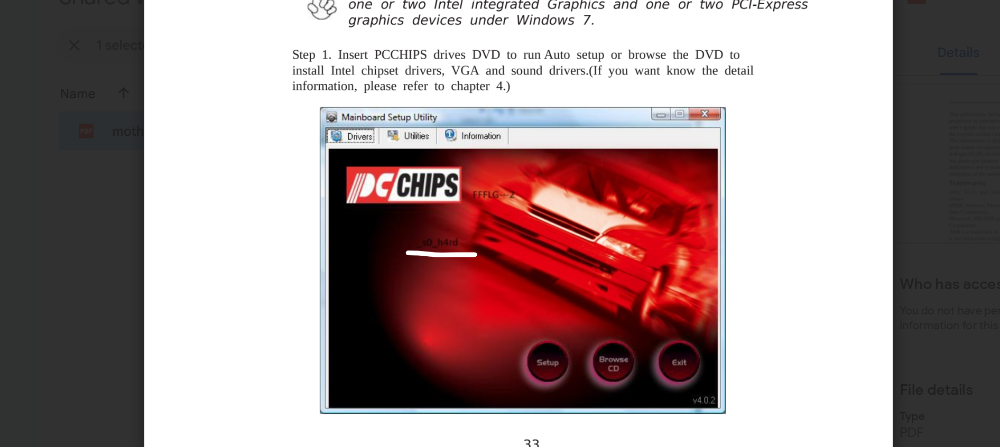

# Level 21: Metal Door

## Problem

The metal door slowly opens up. On the other side, you find a primitive civilization, antithetical to the ruins you saw in the city. You find a small population of humanoids who seem to survive on primitive agriculture. Your presence raises curiosity among these humanoids. SPOCK tells you that using the data you have collected so far, he can translate their speech. You are now approached by the village elder. You explain your journey and the path that led you here. The elder is suspicious at first but realizes that the computer system at the center of the Town Hall chose to send you here. If it trusts you then so should he. He then turns around and leads you through a dark alleyway by the side of the cave-like bunker. After a long walk, you are led to a room with another giant computer that displays schematics of advanced weapons hidden under the surface of the planet. These can only be accessed from the Town Hall but you will need a special chip to access them. These chips were manufactured by Terraneous BigChips, who used to be very active on a particular prehistoric social media platform, owned by one of the space race pioneers.

## Writeup

Got to say hands down the most fun we had while solving this one.

Alright mostly important stuff we can get is that we need to find something related to "Terraneous BigChips", and the fact that we are told social media platform owned by one of the space race pioneers, it's Twitter.

Alright off to twitter, searching the name itself brings an account https://twitter.com/TBigchips43199/

Many tweets and threads all on May 9 but most standout are two tweets. First one gives us a part of the flag

`n0t_3asy}`

next one is about a new release and they have a link to their blog post https://terraneousbigchips.blogspot.com/2023/10/revolutionizing-space-race-mx4560.html

Going to the blog post we see a lot of text in english and in other languages as well.

Mostly translating and going through other profiles helped grow on me how important and personal the company Terraneous BigChips felt to me. It is a feeling that I will never forget. 

ANYWAY, in the arabic part there is a link given which is reverse. We get a link to a youtube channel https://www.youtube.com/@Terraneous_BigChips

In the channel there is a video talking about breaking space. The video is an informercial about how great Terraneous BigChips is baby 🔥🔥🔥

Also it was great to see people cheering us on. 

Anyway some guy was slandering bigchips on the comment to which the youtuber also responded. For some reason there it is showing 2 replies but when you scroll down there is only 1 reply.

The catch is to sort comments by new, idk how does that work but it worked 🗿

We are now given a drive link to a manual page. After scrolling we can find a part of the flag in this pdf itself

`sctf{mak1ng_chip5_`

After scrolling for a while we spotted another part of the flag hidden in a picture but visible after looking at it carefully

`_s0_h4rd`

Adding these parts together we get the flag as

`sctf{mak1ng_chip5_s0_h4rd_n0t_3asy}`
