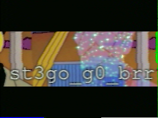
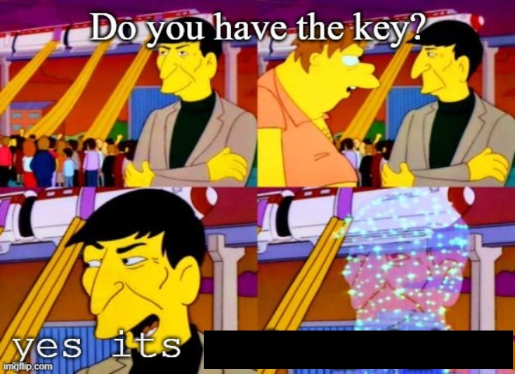

# Level 22: Town Hall Access

## Problem

You have received the chip from the bunker, but as soon as you leave the bunker, you feel the ground shake. You get a distorted alert message from Spock, you must decode the message to identify the danger.Sources let you know it was a Picture transmission method used mainly by amateur radio operators.

## Writeup

This is similar to a BugBase CTF Challenge that took place prior this year. 

First the wave file is SSTV. So we can use an [sstv decoder](https://github.com/colaclanth/sstv).

```
└─$ sstv -d q22aud.wav
[sstv] Searching for calibration header... Found!
[sstv] Detected SSTV mode Robot 36
[sstv] Decoding image...   [######################################################################################] 100%
[sstv] Drawing image data...
[sstv] ...Done!
```
We got a result.png 



Perfectly places in the empty space we have in the other image



so the key is `st3go_g0_brr`

as it tells it is stego that means the given image is steghiding something. So,

```
└─$ steghide --extract -sf q22.jpg
Enter passphrase:
wrote extracted data to "emb.txt".
└─$ cat emb.txt
sctf{z0rbs_4re_h3r3}
```

`sctf{z0rbs_4re_h3r3}`


