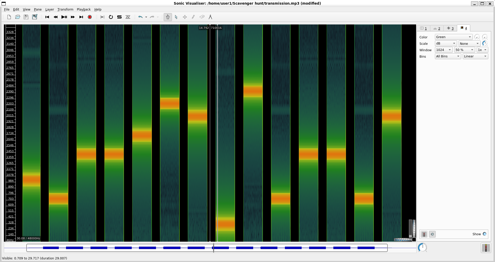

# Level 23: Decode Danger

## Problem

You have successfully decoded the message but as soon as you read the message, you feel a shiver down your spine, your ship and your teammates have been attacked by an alien vessel known as Zorbs. You don’t know the state of your ship’s AI as well as your teammates, so you rush down to the town hall with the chip to access the planet's resources. When…..


The comms panel lights up with a new transmission. After descrambling and filtering the noise, a series of strange beeps is heard. Upon observing the pattern of the beeps, a rudimentary key is developed.

## Writeup

Given an audio file, while listening to it seems like different frequencies being sent, and seeing at the key, it wants to decipher based on the hertz value. So we put this audio file in sonic visualiser, apply a spectogram and zoom in so we can see and hover and find out which frequency at a certain time



looking at the key, we can see it is evenly spaced, thus we can make the whole key of all alphabets. Thus to automate we just make a python script and record all the frequencies we see here

```python
key = {};
current = 300;
for i in "abcdefghijklmnopqrstuvwxyz":
    key[current] = i;
    current += 100;
cipher = [1000, 700, 1400, 1400, 1700, 2200, 2000, 300, 2400, 700, 1400, 1400, 700, 2000]
for i in cipher:
    print(key[i], end="")
```
`hellotraveller`

`sctf{hellotraveller}`