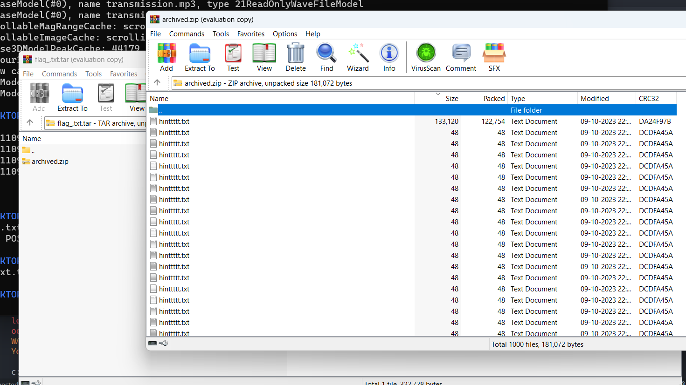
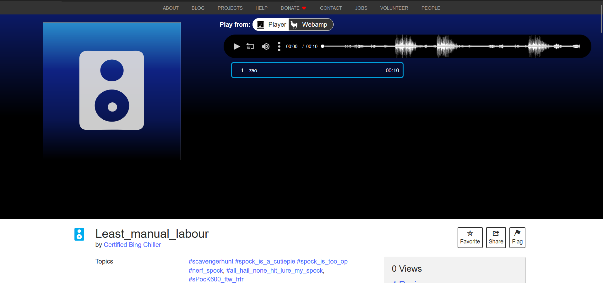
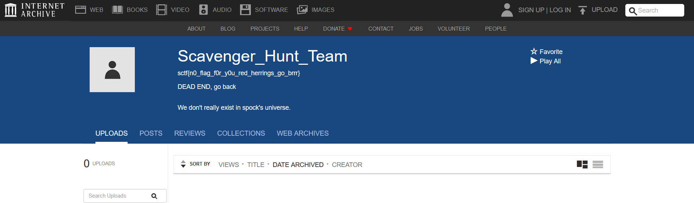
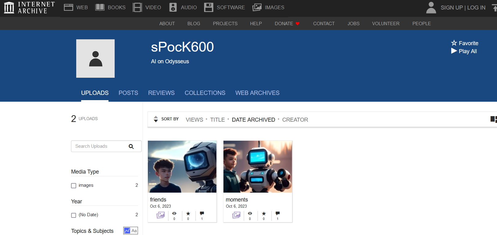
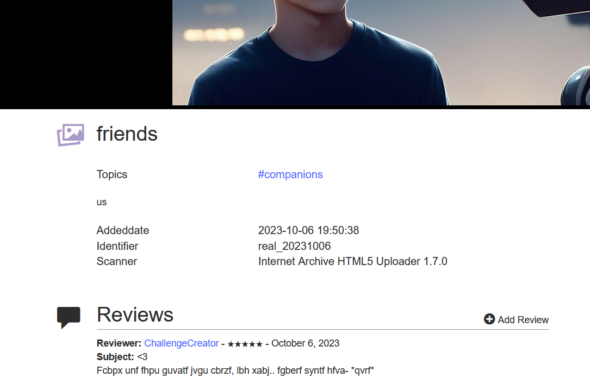
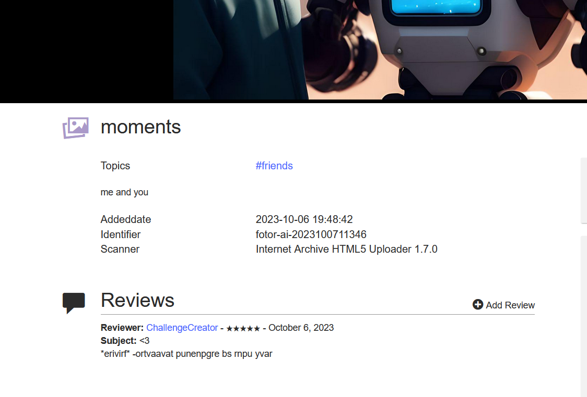
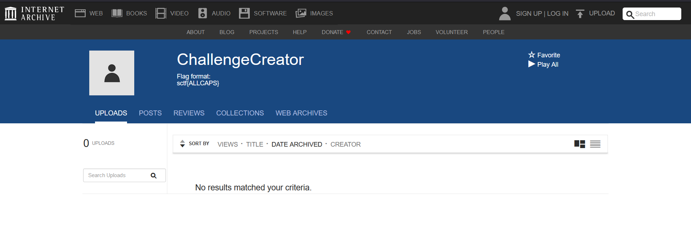
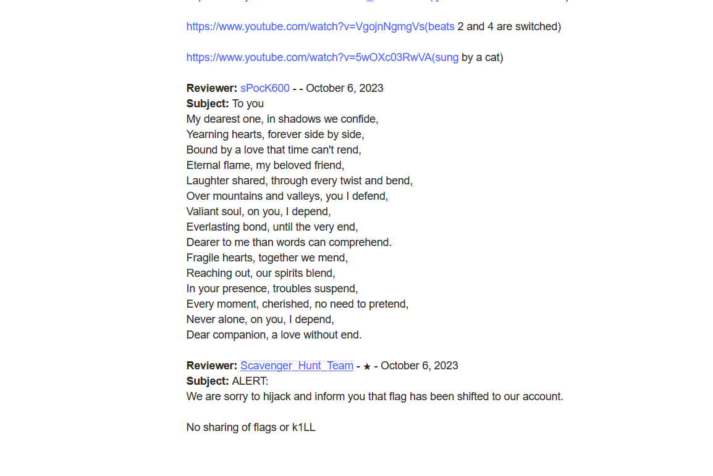

# Level 24: Fixing SPOCK

## Problem

You manage to distract the alien ship by using the planet's defense system. Now you rush out of the town hall, towards your ship afraid of what might have happened to your ship. Upon reaching your ship, you analyse the damage that has been dealt to it. The ship has been severely damaged by the Zorb’s attack. You find Spock in a burned-up state, capable enough to keep the ship running and your teammates safe but Spock is about to turn off. You must rush to fix Spock.

## Writeup

we got a weird file

```
└─$ file flag_.txt.txt
flag_.txt.txt: POSIX tar archive (GNU)
```
now we could go the usual route of unziping based on given folder types but to make our life much easier, we just use winrar.

opening the tar file had another zip file in it, and when opened had an uncountable number of hinttttt.txt file. By sorting by size we can see which one is the important one out of them all



analyzing this odd hinttttt.txt file shows that it's another tar zip that has a .gz that inside has an image which actually is also zip that has a flag.txt. That flag.txt has this
```
For the 'final' step,'spock has 'archive'd the 'flag' publically under identifier 'zao_20231006'
```
from the word identifier, we can assume they mean the archive articles. So we go to archive.org and search.

https://archive.org/details/zao_20231006



We get one epic soundtrack. We have 4 reviews under it.
https://archive.org/details/@challengecreator
https://archive.org/details/@spock600
https://archive.org/details/@scavenger_hunt_team

The one by scavenger hunt team says it has the flag, and if you go to it's profile and find one, it's a red herring.



Then we go to the spock account to find it has left 2 images.



Under that Challenge Creator has left messages under each one of them in ROT13. 




Which decodes to...
```
Spock has such things with poems, you know.. stores flags usin- *dies* 
*revives* -beginning character of each line
```
We go to challenge creator's profile to get the format which is in all caps.



Then we go back to the original GOATED soundtrack post to see spock's review of him sending a poem.



```
My dearest one, in shadows we confide,
Yearning hearts, forever side by side,
Bound by a love that time can't rend,
Eternal flame, my beloved friend,
Laughter shared, through every twist and bend,
Over mountains and valleys, you I defend,
Valiant soul, on you, I depend,
Everlasting bond, until the very end,
Dearer to me than words can comprehend.
Fragile hearts, together we mend,
Reaching out, our spirits blend,
In your presence, troubles suspend,
Every moment, cherished, no need to pretend,
Never alone, on you, I depend,
Dear companion, a love without end. 
```
We take each one's beginning letter to get the flag.

`sctf{MYBELOVEDFRIEND}`