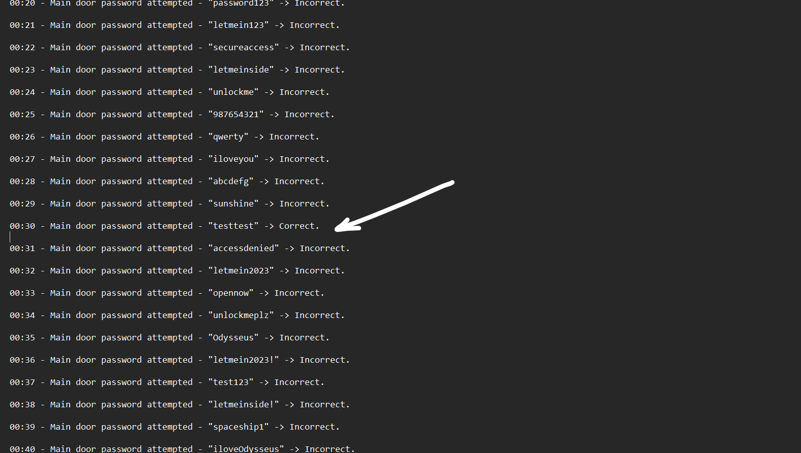

# Level 25: Wake All

## Problem

You have fixed Spock but now the ship can’t sustain any more damage. With the ship’s life support systems in disarray, it is no longer safe for your crewmates. You must wake them up and evacuate the ship. While you try evacuate the main door is not opening you must somehow bypass the error that is causing the door to not open. The password to the door must be somewhere in the ship logs.

TIP:Not all functions are very nice, or helpful.

## Writeup

Checking the internal logs, we see there is one odd one out password that says Correct. 



password = `testtest`

now running the given binary in gdb

```
└─$ gdb wake_all_module
gef➤  disass main
Dump of assembler code for function main:
   ...
   0x0000555555555352 <+250>:   call   0x555555555070 <printf@plt>
   0x0000555555555357 <+255>:   mov    eax,0x0
   0x000055555555535c <+260>:   call   0x5555555551a9 <fuckyou>
   0x0000555555555361 <+265>:   lea    rdx,[rbp-0x30]
   0x0000555555555365 <+269>:   lea    rax,[rbp-0x50]
   0x0000555555555369 <+273>:   mov    rsi,rdx
   0x000055555555536c <+276>:   mov    rdi,rax
   ...
   0x00005555555553ab <+339>:   ret
End of assembler dump.
```
In the question we need to skip a function and that most likely will be a cussword. So to skip this function call we can break at the function call and jump to the next instruction.

```
gef➤  b *0x000055555555535c
Breakpoint 1 at 0x55555555535c
gef➤  r
Starting program: /home/user1/Scavenger hunt/wake_all_module
[Thread debugging using libthread_db enabled]
Using host libthread_db library "/lib/x86_64-linux-gnu/libthread_db.so.1".

Enter the password to the exit door:-
testtest

Your input:
0x74    0x65    0x73    0x74    0x74    0x65    0x73    0x74

Breakpoint 1, 0x000055555555535c in main ()
gef➤  j *0x0000555555555361
Continuing at 0x555555555361.
Critical Error unable to open the door-
Door is Opening, Evacuate NOW!!!!!
sctf{wHaT_A_bOzo}[Inferior 1 (process 429) exited normally]
```

`sctf{wHaT_A_bOzo}`