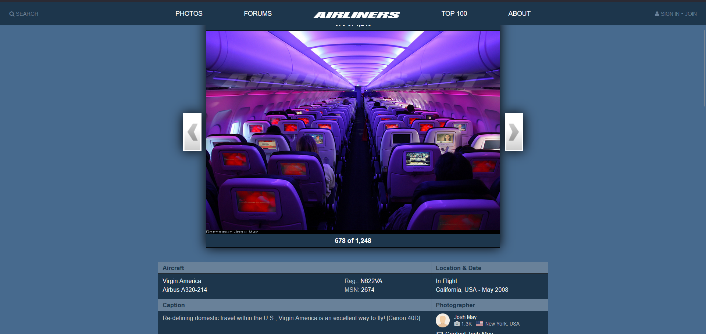
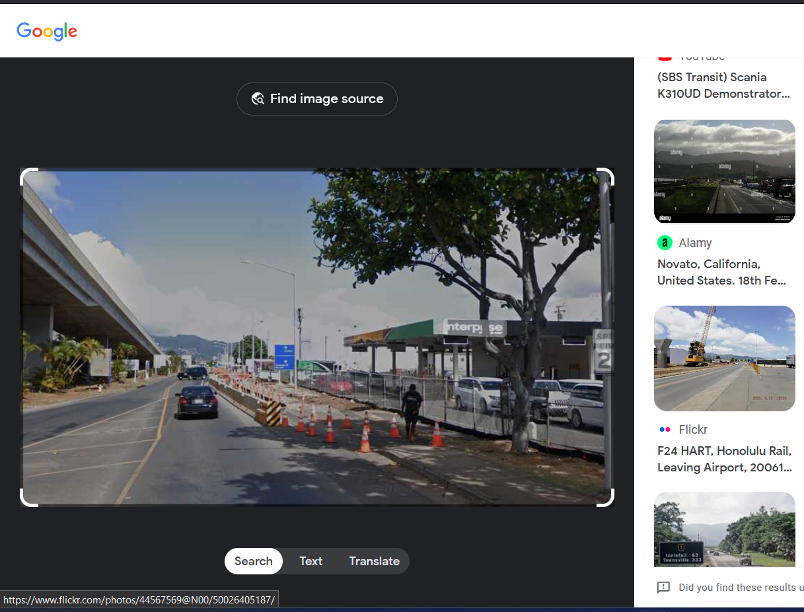
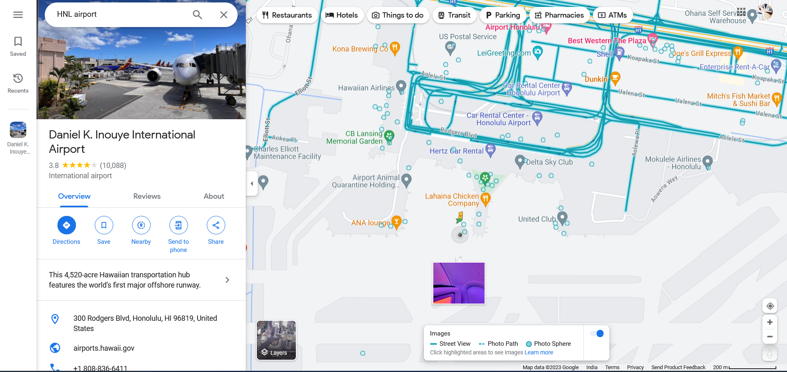
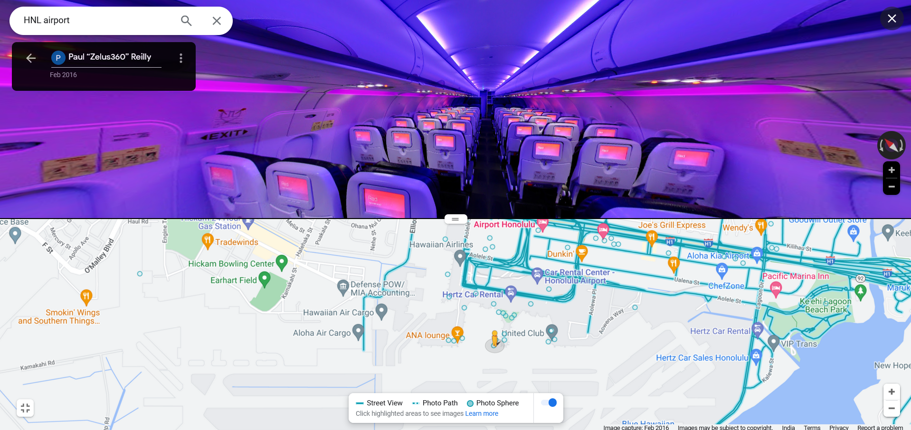
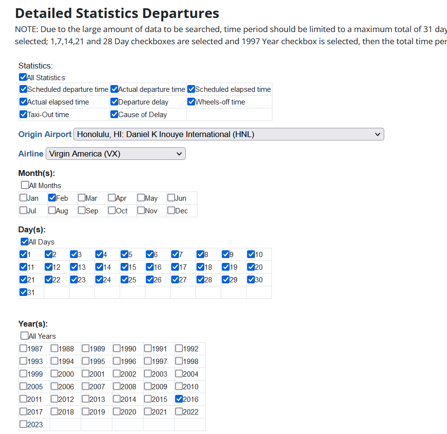
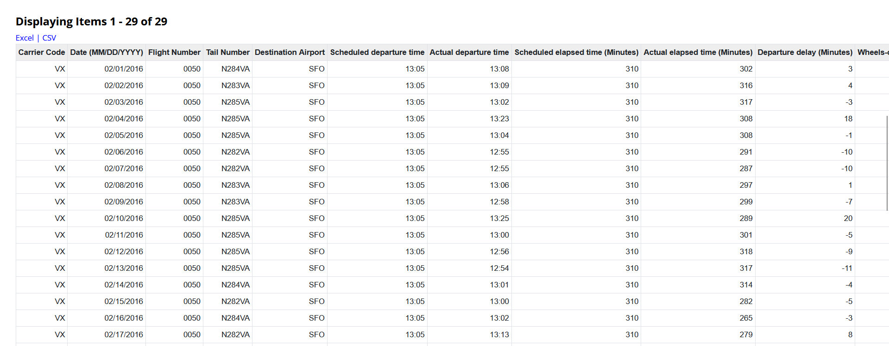
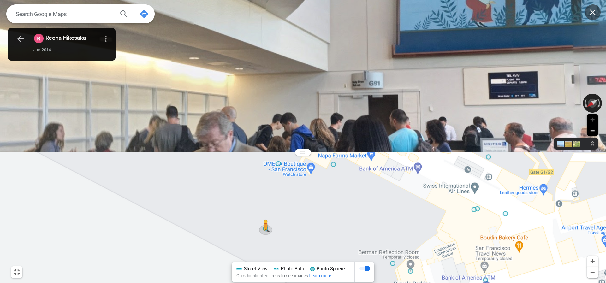
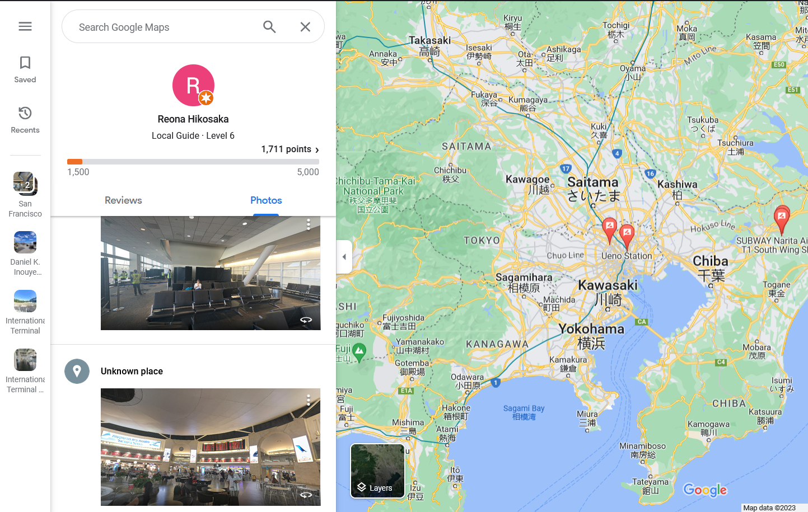
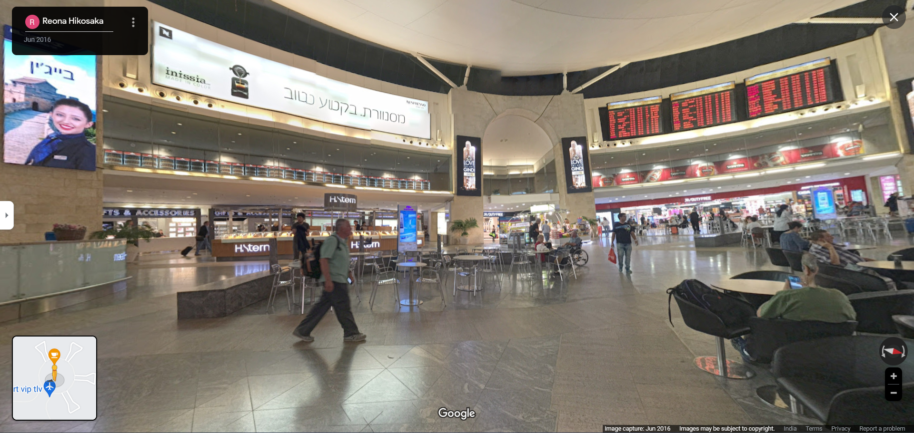

# Level 26: ZORB Ship

## Problem

You wake your teammates up, and you all gather around the ship’s wreckage. You explain to them about the planet you are on and how it has been and is sustaining life. Your team can now start its own life on this planet, but to survive you must defeat the aliens attacking the planet. You lead your team into the Town Hall, where they meet the original inhabitants of the planet.
You all must unite as a team to defeat the aliens.You go towards the main computer to launch the attack. But, you don’t know the location of the Zorb ship where these attacks originate.
You remember SPOCK telling you that they log their location coordinates in a secret coffee machine located in an airport. He tells you that attempts were made to track down this coffee machine but they never succeeded. He hands over to you a report made by the last lead that went cold. It’s intentionally missing parts so that the lead could plead innocence in case they got caught. 

Report:
Subjects were first seen renting a car at an intersection following which they boarded a cyberpunk-era air-cruiser. One of them had an insignia that said “Zelus360”. I followed them to their destination but they managed to disappear. I kept waiting. Four months later they showed up again. This time they were seen boarding an international flight to a middle eastern country though a G something gate. This confirms that they had the secret data with them and that they were fleeing. But I lost them again as I forgot my passport. Thankfully I had a contact ready in the destination country who confirmed the subjects relaxing in the central lobby at around 23:00 local time. And then they disappeared after taking the picture of a banner ad.
Flag format (all lowercase):
sctf{COFFEE-MACHINE-COMPANY-NAME_AIRPORT-3-LETTER-CODE}
for eg. sctf{samsung_jfk}

## Writeup

How in sanity is someone supposed to solve this normally 😭😭. 

Alright reverse searching the second picture

https://www.airliners.net/photo/Virgin-America/Airbus-A320-214/1538967

The plane belongs to Virgin America.

Reverse searching the first picture

Somehow we find out that this image is near the Honnolu Airport (HNL). The report says that the people boarded on HNL airport and landed somewhere where we lose them and they appear 4 months later in that airport. One of them had "Zelus360" meaning a 360 photographer. Let's try to search on street view at HNL airport for a virgin america plane.

https://www.google.com/maps/@21.3291411,-157.9210217,3a,75y,45.8h,85.82t/data=!3m10!1e1!3m8!1sAF1QipOeBu_VijPm7BZFEQFBz6BeQjeZ2zj2aa--oRvQ!2e10!3e11!7i13312!8i6656!9m2!1b1!2i49?hl=en-IN&entry=ttu

As this person has the name "Zelus360" this is the one we are trying to find. The image capture was taken on Feb 2016. Let's find the flights that are going from HNL on Feb 2016.

https://transtats.bts.gov/ONTIME/Departures.aspx

All flights go to SFO, so they have gone to SFO. We are told they are present at the G gates so we can try searching for a person going to a middle eastern country. Don't know how but there is a G91 gate, where a street view is present which goes to tel aviv on June 2016.

https://www.google.com/maps/@37.6170305,-122.3913481,3a,15y,125.18h,94.06t/data=!3m11!1e1!3m9!1sAF1QipPKwVv5pnDREHQ2eGV9NT2DGJSCPN1Z7bIk39Zt!2e10!3e11!6shttps:%2F%2Flh5.googleusercontent.com%2Fp%2FAF1QipPKwVv5pnDREHQ2eGV9NT2DGJSCPN1Z7bIk39Zt%3Dw203-h100-k-no-pi-0-ya184.01439-ro0-fo100!7i8704!8i4352!9m2!1b1!2i47?hl=en-IN&entry=ttu

Alright we are supposed to follow this person only. We can search up there google map history.

They are present in tlv airport and there is a banner of the coffee company inissia.

`sctf{inissia_tlv}`