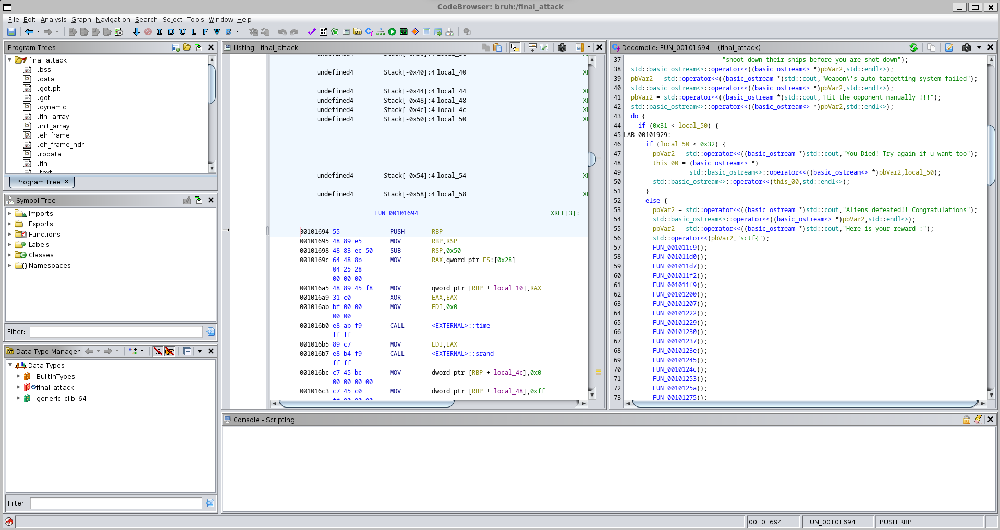
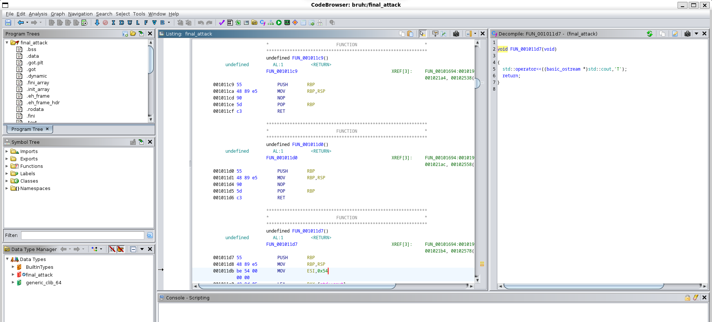

# Level 28: Final Attack

## Problem

After submitting flag Part two opens which is *insert above bracketed text here You find the way to the weapon location and reach there to find that the weapon has been dormant for a long time, and all its power has been drained. Now it needs a big supply of energy to initiate the attack.
Spock suggests he can be used as the energy beacon to kick-start the weapon.
The weapon has been restored to its full potential, but it has damaged Spock to a great extent, his circuits are overloaded and he seems unresponsive. You and your team prepare for the final attack on the aliens. You all gather at the town hall and plan your path to glory.
You step up to use the weapon to avenge your loss and the death of your buddy Spock. You charge with all your potential for a final attack.
This is going to be tough battle

## Writeup

We are given a binary file this time with no info. So our best choice is to open it in ghidra and analyze the main function.

There must have been an actual exploit to use on this binary file, as it takes in greater than 49 and less than 50 coordinates or something but I used a different approach to just search for the flag.

There are many functions that are to display the flag. And coincidentally all of them are in one line in the assembly code.

So after scrolling down and recording each character that appears, we can get the flag.

`sctf{Th3_1a5t_5tr3tcH_conquered}`