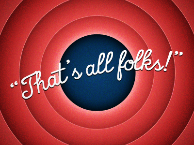

# Level 29: The End

## Problem

Congratulations on surviving the alien attack!
Your exceptional resilience, courage, and resourcefulness are a testament to the indomitable human spirit.

Your strength and determination in such extraordinary circumstances are truly out of this world, and your ability to persevere sets an inspiring example for us all. We are immensely grateful that you have returned to us safe and sound.

This experience serves as a powerful reminder of your extraordinary capabilities and your capacity to conquer the most extraordinary challenges. As we look to the vast universe and its mysteries, your survival stands as a testament to the resilience of humanity.

We commend your bravery and strength. Keep shining brightly, knowing that you have faced the unimaginable and emerged victorious. You can contact Team Cryptonite and share the position in the leaderboard for further proceedings.

Well Done!

## Writeup

