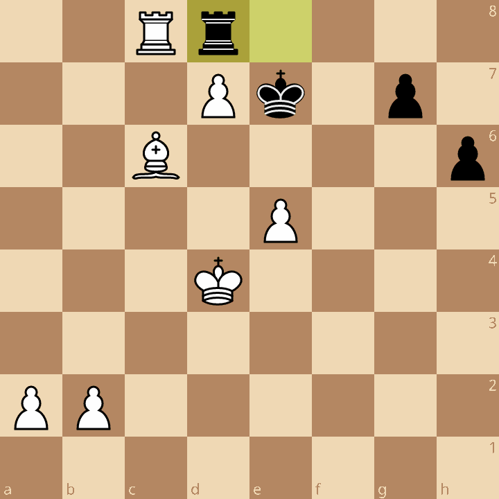
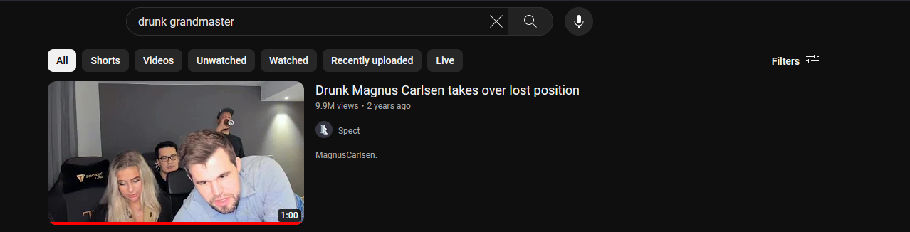
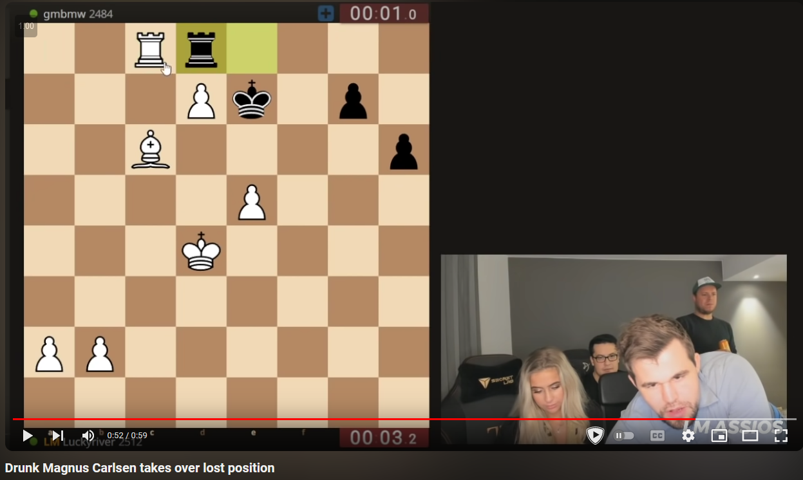

# After hours stockfish (50)

Category - Misc

Challenge Question

The Grandmaster never needs to stay sober to destroy opposition!

The Flag should be wrapped in aCTF{}

Hints
1) The flag is case sensitive
2) Looks are not always deceiving
3) Rook move leads to checkmate
4) 4-5 move checkmate 

# Solution

Given a chess position 

The challenge question talks about being drunk, searchin you will stumble on a viral video of GM Magnus Carlsen  while being drunk

This has the same specific position

from here take all the moves played by Magnus and put it in as the flag

`aCTF{Rxd8Kxd8Kd5g5e6g4Kd6g3e7#}`