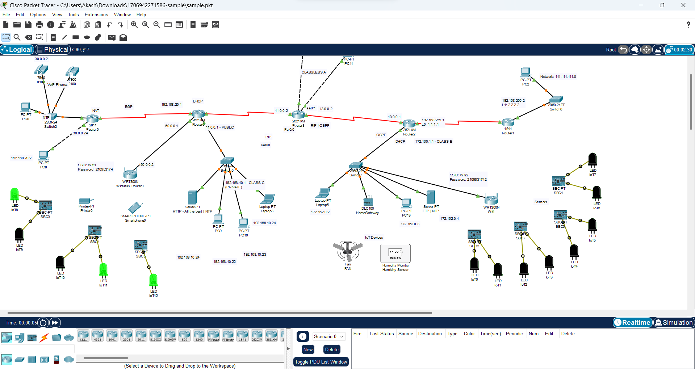

# Blinding Lights (250)

Category - Crypto

Challenge Question

*I said, ooh, I'm blinded by the ~~lights~~

No, I can't sleep until I feel your touch

I said, ooh, I'm drowning in the night

Oh, when I'm like this, you're the one I trust*

The Flag should be wrapped in aCTF{}

Hints
1) To solve the leaky bucket problem, maybe check the tap.
2) The file given is a Cisco Packet Tracer file
3) Take note on how the LEDs taps
4) Dive deep into tapcodes

## Solution

Open the given file in Cisco Packet Tracer.



The leds are the leak taps. We can get the flag with [TapCode](https://en.wikipedia.org/wiki/Tap_code) cipher.

Count every flash of an led until you get a good gap. Do this twice. Find the character from the table in the wikipedia.

```
0 -> 3 3 -> N
1 -> 1 5 -> E
2 -> 4 4 -> T
3 -> 5 2 -> W
4 -> 3 4 -> O
5 -> 4 2 -> R
6 -> 1 3 -> C/K
7 -> 4 4 -> T
8 -> 1 1 -> A
9 -> 3 5 -> P
10 -> 3 5 -> P
11 -> 1 5 -> E
12 -> 1 4 -> D
```

`aCTF{networktapped}`