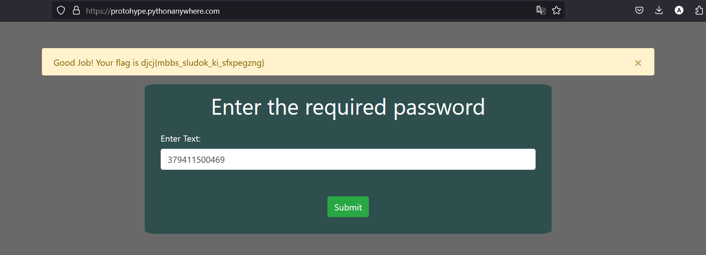

# Call 911 (50)

Category - OSINT

Challenge Question

Caught Red-Handed: A Lockdown With Consequences

The Flag should be wrapped in actf{}

Link 1: 
https://protohype.pythonanywhere.com/

Hints
1) Consider the legal framework surrounding digital info

## Solution

Given data.txt. There are 5 laws given which belong under the Indian Constitution. Google them to get their Penal codes

`379411500469`

This is the password to be given in the website



`djcj{mbbs_sludok_ki_sfxpegzng}`

Finding it at first is difficult but you need to subtract the Penal code password from the given flag to the actual flag

```python
a = "djcj{mbbs_sludok_ki_sfxpegzng}"
p = "379411500469" * 3
alpha = "abcdefghijklmnopqrstuvwxyz"
offset = 0

for i in range(len(a)):
    if a[i] in "{}_": 
        print(a[i], end="")
        offset += 1
        continue
    print(alpha[(alpha.find(a[i]) - int(p[i - offset]) ) % 26], end="")
```

`actf{laws_should_be_respected}`