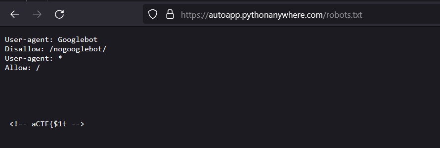
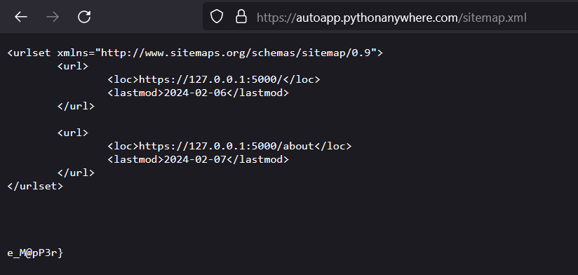
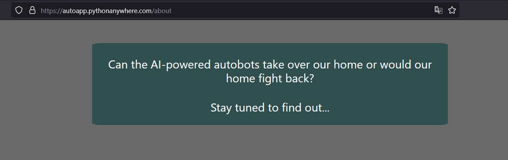

# Cyber Showdown (50)

Category - Web

Challenge Question

AI is taking over the world, or is it?

The Flag should be wrapped in aCTF{}

Link 1: https://autoapp.pythonanywhere.com/

Hints
1) How can you explore the website's routes?
2) Try mapping and exploring the website maybe you'll get lucky

## Solution

Described in Hacktricks [inital checks](https://book.hacktricks.xyz/network-services-pentesting/pentesting-web#initial-checks) these are default pages you should check first hand when pentesting.

- /robots.txt
- /sitemap.xml
- /crossdomain.xml
- /clientaccesspolicy.xml
- /.well-known/

Or you can run [`dirsearch`](https://github.com/maurosoria/dirsearch) on the website to get all open routes. that gives

```
└─$ dirsearch -u https://autoapp.pythonanywhere.com/

  _|. _ _  _  _  _ _|_    v0.4.3
 (_||| _) (/_(_|| (_| )

Extensions: php, aspx, jsp, html, js | HTTP method: GET | Threads: 25 | Wordlist size: 11460

Output File: /home/user1/aurora/downloads/reports/https_autoapp.pythonanywhere.com/__24-02-08_21-19-38.txt

Target: https://autoapp.pythonanywhere.com/

[21:19:38] Starting:
[21:20:12] 200 -    1KB - /about
[21:22:21] 200 -   93B  - /robots.txt
[21:22:31] 200 -  258B  - /sitemap.xml

Task Completed
```

So we have open /robots.txt, /sitemap.xml and /about, going through them




`aCTF{$1te_M@pP3r}`


