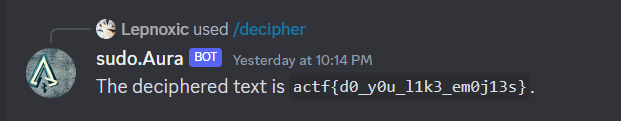

# Emojis? (50)

Category - Misc

Challenge Question

😎😊😜😎😎😊🥳😊😎🥳😎😎🥳😊😊😊😊😜😎😊😎😊😊😎😜😊😇😎😎😇😎😜😊😎😊😊😇🥳😎😎😎😎😎😎😎😇😎😊😎😊😜😊🥳😎😎😊😎😎😎😊😊😊😊😊😎😎😎😇😎😊😊😎😎😎😎😊😎😊😎😎😊😊😇😊😎😎😎😎🥳😊🥳😎😊😊😊😊😎🥳😊😊😎😇😎😎

The Flag should be wrapped in actf{}

Link 1: https://discord.com/invite/HZQ4VNbm

Hints
1) Instead of asking general purpose questions, try asking some protocol-based ones...

## Solution

Given a discord server invite, join it. Find a bot called sudo.Aura

invite the bot to your dms (some other bots you could even invite to your servers and need to setup roles)

discord introduced `/` command helpline. Open `/` to see a decipher command. Give the emoji text given in challenge and get flag.

`actf{d0_y0u_l1k3_em0j13s}`