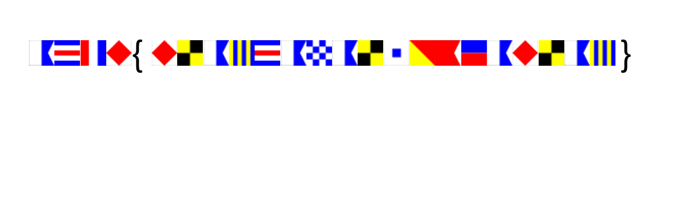
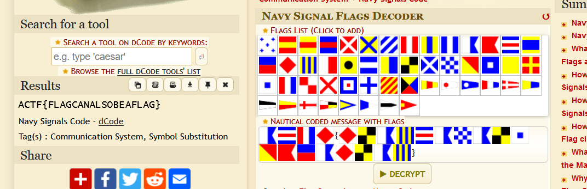

# Even sailors need to talk (50)

Category - Crypto

Challenge Question

Each flag has a different story. To survive in peace and harmony, united and strong, we must have one people, one nation, one flag.

The Flag should be wrapped in ACTF{}

# Solution

given this image

This is talking about a thing called Navy Signal Flag cipher

`ACTF{FLAGCANALSOBEAFLAG}`