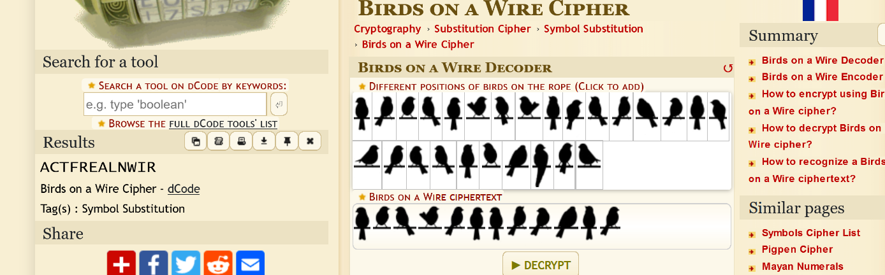

# Exploring Zookeeping (250)

Category - Crypto

Challenge Question

Welcome to your third course on zookeeping, Download the file and read up on some key aspects of zookeeping.

The Flag should be wrapped in aCTF{}

Hints

1) Look for overthewire
2) Not your usual PDF is it?
3) Some sequential alignment unveils the hidden code within the wires
4) Not tool based but guess what changes every page?

# Solution

We are given a pdf with redacted text. They are all red herring. after some googling you will find the original pdf https://winghamwildlifepark.co.uk/wp-content/uploads/2012/12/Research-Using-Zoo-Records.pdf. After observation we can see there is a key difference in the pdf given and the original that the page numbers have specific bird images on them. After googling we find out that there is a [Bird on the wire Cipher](https://www.dcode.fr/birds-on-a-wire-cipher). So we take all the images and decipher it.

Can't get after this