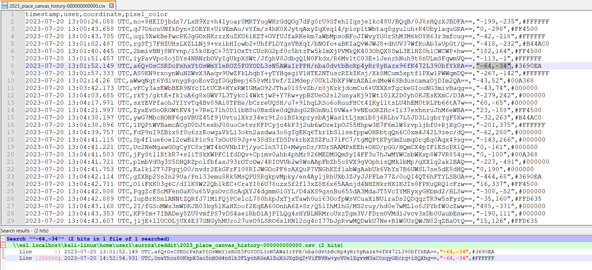

# F*#@ SPEZ (150)

Category - OSINT

Challenge Question

I was suggested by reddit to go to a place but the coordinates were pretty weird. Can you help me figure them out?

Longitude : -64 Latitude : -34 Time : 000000000000

The Flag should be wrapped in aCTF{}

Hints
1) '#' is included in the flag itself

## Solution

Fuck spez was a great moment in r/place 2023. r/place was an online event where redditors placed pixel colors on a big canvas. We have been given coordinates and a time. Being told that # is in the flag means they are asking for the color of that pixel at that time. 

So download the r/place 2023 csv at time 000000000000. Someone made a good shell file to just arrange everything for you [here](https://gist.github.com/uMax31415926/ba0244ff6d1b38f90981a8d39c2c39d3)

open the csv and search for the coordinates

`aCTF{#3690EA}`