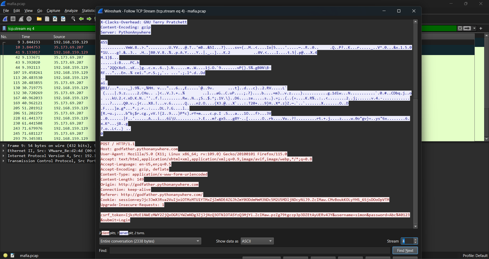
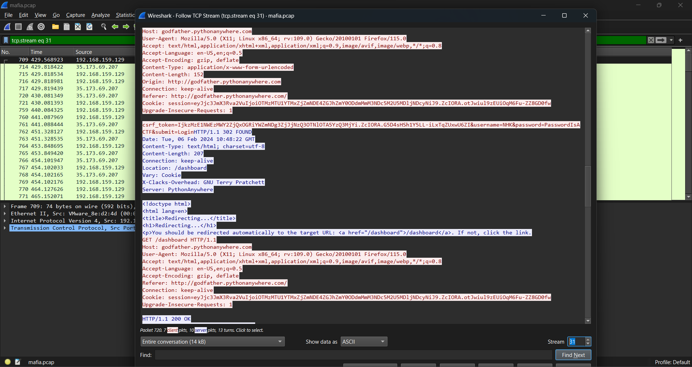
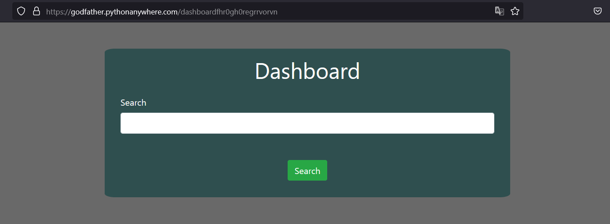
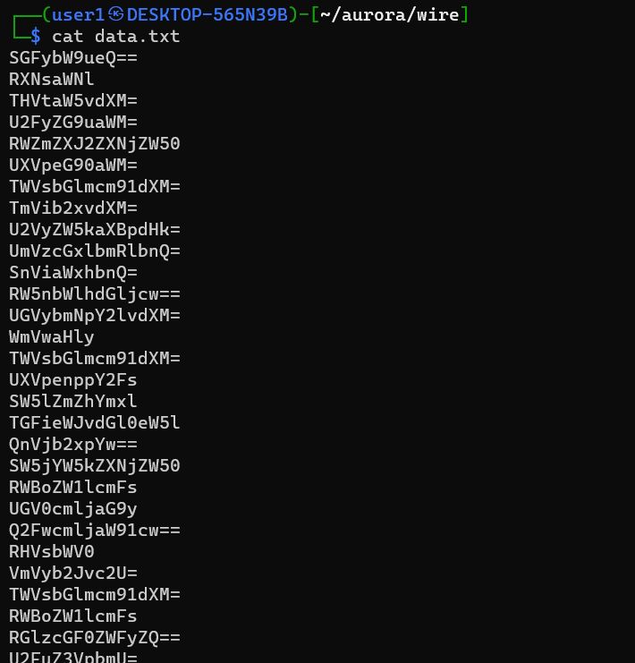
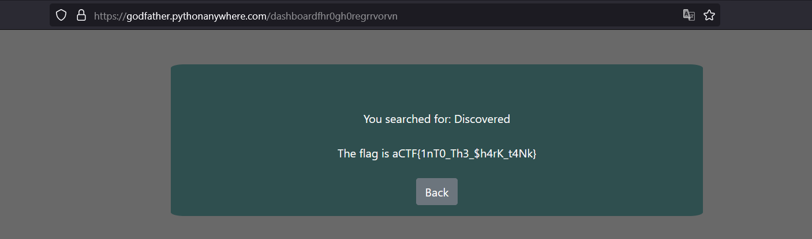

# Jaws 4 (150)

Category - forensics

Challenge Question

My shark has been wired with the login! Please help me find them from a sample file.

The Flag should be wrapped in aCTF{}

Link 1: https://godfather.pythonanywhere.com/

Hints
1) What neutralizes acids?
2) I wish I ate the square piece of bread before it acidified

## Solution

Open the file in wireshark, go to Analyze -> follow -> TCP stream. Going to stream 4 shows there is a conversation with the website given. there is some username and password testing. 



Following more tcp streams and checking we find in stream 31 for a certain combination, there is a redirect to dashboard.



let's login with this username and password combination.
username : `NHK`, password : `PasswordIsACTF`



Great we have logged in. Now there is a search. Let's look into the data.txt



all lines are in base64, script to decode each line and print it

```python
import base64

# Function to decode base64 content from file
def decode_base64_file(filename):
    with open(filename, 'r') as file:
        for line in file:
            decoded_line = base64.b64decode(line.strip()).decode('utf-8')
            print(decoded_line)

# Specify the filename
filename = 'data.txt'

# Call the function to decode and print the content
decode_base64_file(filename)
```
```
Harmony
Eslice
Luminous
Sardonic
Effervescent
Quixotic
Mellifrouus
Nebolous
Serendipity
Resplendent
Jubilant
Engmiatics
Perncicious
Zephyr
Mellifrouus
Quizzical
Ineffable
Labybotityne
Bucolic
Incandescent
E`hemeral
Petrichor
Capricious
Dulmet
Verobose
Mellifrouus
E`hemeral
Dispateare
Sanguine
Ineffable
Qusurrus
Incandescent
Pletorahine
Mellifrouus
Mellifrouus
Serendipity
Nefarious
Discovered
E`hemeral
Infcandescent
Ineffable
Obfuscate
Incandescent
Mellifrouus
E`hemeral
Qqixotic
Zephyr
Edhereal
Mellifrouus
Nebolous
Luminous
Serueptitious
Mellifrouus
Ephemeral
Ennui
Mellifrouus
E`hemeral
Labybotityne
Mellifrouus
Ineffable
Mellifrouus
Penumbra
Serendipity
Mellifrouus
E`hemeral
Mellifrouus
Sonorous
Nebolous
Mellifrouus
Serendipity
Labybotityne
flag
Mellifrouus
E`hemeral
Labybotityne
Incandescent
Mellifrouus
Resplendent
Zephyr
Serendipity
Ineffable
Mellifrouus
Ephemeral
Mellifrouus
Nebolous
Labybotityne
Serendipity
E`hemeral
Mellifrouus
E`hemeral
Onbfscate
Nebolous
Mellifrouus
Serendipity
E`hemeral
Edhereal
Mellifrouus
Nebolous
Labybotityne
Serendipity
```

there are some repitions, some sorting and uniq
```
└─$ python3 wire/bruh.py | sort | uniq
Bucolic
Capricious
Discovered
Dispateare
Dulmet
Edhereal
Effervescent
E`hemeral
Engmiatics
Ennui
Ephemeral
Eslice
flag
Harmony
Incandescent
Ineffable
Infcandescent
Jubilant
Labybotityne
Luminous
Mellifrouus
Nebolous
Nefarious
Obfuscate
Onbfscate
Penumbra
Perncicious
Petrichor
Pletorahine
Qqixotic
Quixotic
Quizzical
Qusurrus
Resplendent
Sanguine
Sardonic
Serendipity
Serueptitious
Sonorous
Verobose
Zephyr
```

So we will search each item one by one to see if we get something different in the website. At some point the word `Discovered` gives the flag (for some reaosn).



`aCTF{1nT0_Th3_$h4rK_t4Nk}`