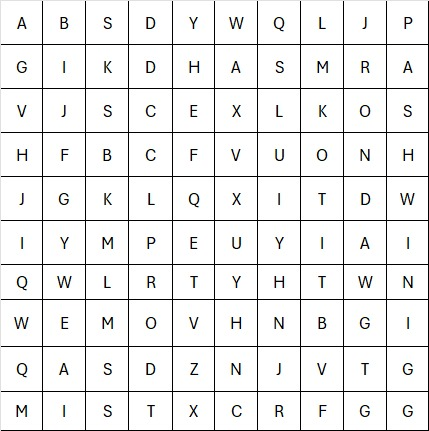
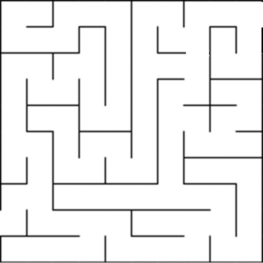
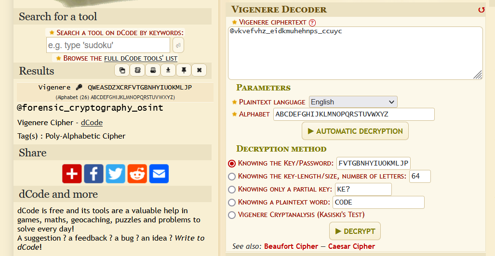
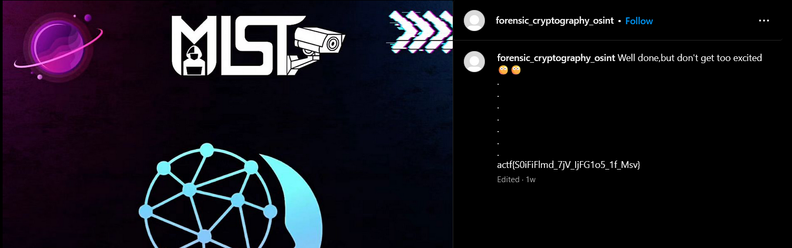
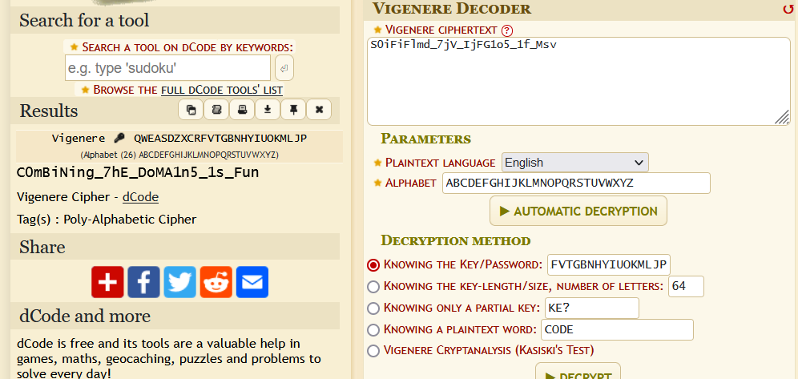

# Melting Pot (400)

Category - Misc

Challenge Question

Unlock the character's binary secrets by deciphering the dance of zeros and ones – pay attention to the rhythm and arrangement of the bits to reveal the hidden data

The Flag should be wrapped in actf{}

Hints
1) Are you ready to mix up all the domains?

## Solution

Classic different zip in a zip of different types. this is all the methods you need to use.

```
┌──(user1㉿DESKTOP-565N39B)-[~/aurora/downloads]
└─$ mv 1707111041164-database.txt database.zip

┌──(user1㉿DESKTOP-565N39B)-[~/aurora/downloads]
└─$ unzip database.zip
Archive:  database.zip
  inflating: data

┌──(user1㉿DESKTOP-565N39B)-[~/aurora/downloads]
└─$ file data
data: bzip2 compressed data, block size = 900k

┌──(user1㉿DESKTOP-565N39B)-[~/aurora/downloads]
└─$ mv data data.bz2

┌──(user1㉿DESKTOP-565N39B)-[~/aurora/downloads]
└─$ bzip2 -d data.bz2

┌──(user1㉿DESKTOP-565N39B)-[~/aurora/downloads]
└─$ file data
data: gzip compressed data, was "data", last modified: Fri Jan 26 05:37:23 2024, from Unix, original size modulo 2^32 60964

┌──(user1㉿DESKTOP-565N39B)-[~/aurora/downloads]
└─$ mv data data.gz

┌──(user1㉿DESKTOP-565N39B)-[~/aurora/downloads]
└─$ gunzip data.gz

┌──(user1㉿DESKTOP-565N39B)-[~/aurora/downloads]
└─$ file data
data: bzip2 compressed data, block size = 900k

┌──(user1㉿DESKTOP-565N39B)-[~/aurora/downloads]
└─$ mv data data.bz2

┌──(user1㉿DESKTOP-565N39B)-[~/aurora/downloads]
└─$ bzip2 -d data.bz2

┌──(user1㉿DESKTOP-565N39B)-[~/aurora/downloads]
└─$ file data
data: POSIX tar archive (GNU)

┌──(user1㉿DESKTOP-565N39B)-[~/aurora/downloads]
└─$ tar xvf data
DATA/
DATA/data.txt
DATA/Grid.jpeg
DATA/Maze.jpeg
```

open the Grid and maze jpeg





Solve the maze and follow your trail and get the key characters

`qweasdzxcrfvtgbnhyiuokmljp`

in data.txt we have cipher text. After guessing, it is found out that it is Vigenere Cipher.



this is an instagram handle



this still doesn't look deciphered, decipher it again with Vigenere



`actf{C0mBiNing_7hE_DoMA1n5_1s_Fun}`