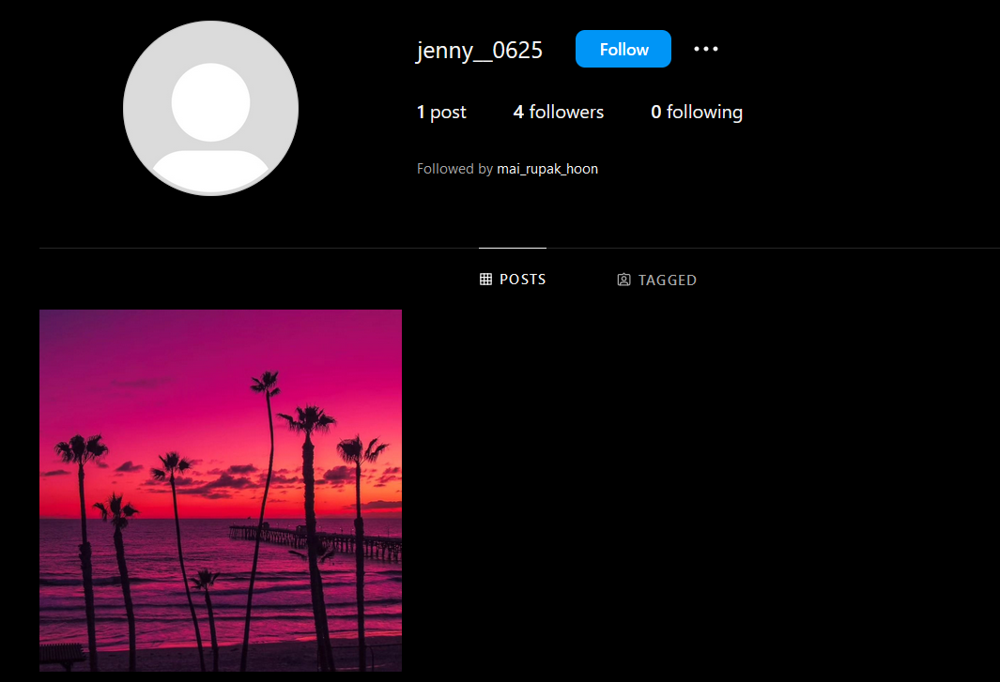
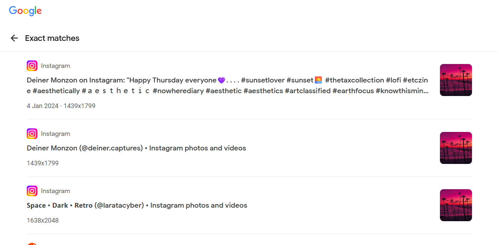
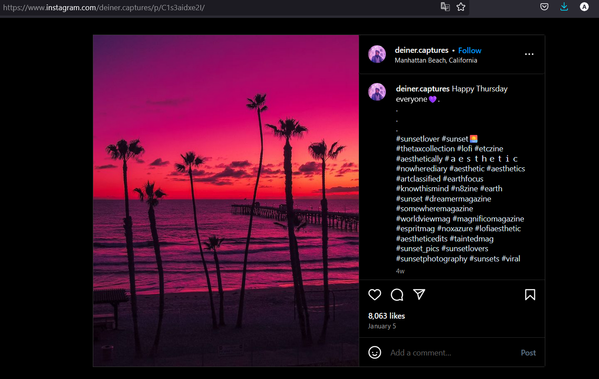
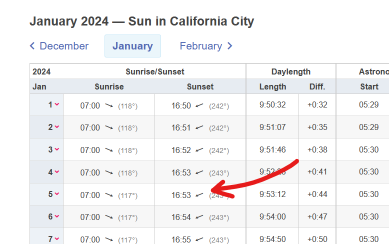

# PAPARAZZI (150)

Category - OSINT

Challenge Question

look at my instagram!! I just made it!! ig handle : @jenny__0625

The Flag should be wrapped in aCTF{}

Hints
1) What do you like more? Dusk or dawn?
2) The flag should be aCTF{city_time}
3) Get your timings right ;)
4) Check GMT and 24hr format
5) Time portion of the flag consists of ONLY digits

## Solution

Open the instagram handle

it says photographer did a great job, find the photographer.
revere search this image

The location shows Manhattan Beach, California. So the city is california. The date is January 5th. It is sunset, find sunset time on January 5th for california.

with some bruteforcing, we get the flag

`aCTF{california_1658}`