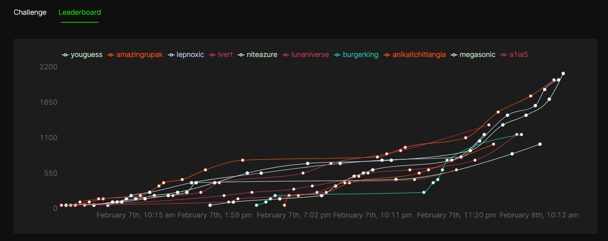

# Aurora CTF (2023)

**Aurora CTF** brought to you by the Official Cybersecurity Club of Manipal, MIST Experience the thrill and competitive adrenaline rush while racing against time to attack challenges and a chance to win from a prize pool of Rs. 6000 

Timings: February 7th, 2024 00:30am - February 8th, 2024 12:00pm

## Leaderboard

| Ranking | User | Points |
| ------- | ---- | ------ |
| 1 | youguess | 2100 |
| 2 | amazingrupak | 2000 |
| 3 | lepnoxic | 2000 |
| 4 | lvert | 1300 |
| 5 | niteazure | 1150 |
| 6 | lunaniverse | 1150 |
| 7 | burgerking | 1150 |
| 8 | anikaitchitlangia | 1000 |
| 9 | megasonic | 1000 |
| 10 | a1ia5 | 600 |
| 11 | crab_snk | 600 |
| 12 | ishaang23 | 400 |
| 13 | theoneandonly | 350 |
| 14 | anwak91 | 350 |
| 15 | priyansh_81 | 350 |
| 16 | suvan9 | 350 |
| 17 | fiendfyre | 250 |
| 18 | hrith | 250 |
| 19 | nicknocks | 200 |
| 20 | vik028 | 200 |
| 21 | beingpandey | 150 |
| 22 | adityachopra | 100 |
| 23 | arshu | 100 |
| 24 | pranav121 | 100 |
| 25 | gr8fury | 50 |
| 26 | pragya | 50 |
| 27 | h.xn.if | 50 |
| 28 | mm174 | 50 |
| 29 | agrimgreat | 50 |
| 30 | k1voh | 0 |
| 31 | situtech | 0 |
| 32 | mvar04 | 0 |
| 33 | ashwin | 0 |
| 34 | asmitag12 | 0 |
| 35 | hridoy | 0 |
| 36 | sangini | 0 |
| 37 | nayanko | 0 |
| 38 | newbee24 | 0 |
| 39 | tenotan | 0 |
| 40 | adityaanand | 0 |
| 41 | dishita_goyal | 0 |
| 42 | tanay_t | 0 |
| 43 | shanu421 | 0 |
| 44 | prasad | 0 |
| 45 | sanidhya_230907490 | 0 |
| 46 | veena_viswanathan | 0 |
| 47 | kirit0me | 0 |
| 48 | eternalravager | 0 |
| 49 | rushank | 0 |
| 50 | lakshmihollat | 0 |
| 51 | kshitij | 0 |
| 52 | darkbind | 0 |
| 53 | saumya06 | 0 |
| 54 | ab | 0 |
| 55 | promit_biswas0375 | 0 |
| 56 | macrolide | 0 |
| 57 | ridhimav | 0 |
| 58 | mayank_2580 | 0 |
| 59 | pranith | 0 |
| 60 | v3sper | 0 |
| 61 | sk01 | 0 |
| 62 | devadathan22 | 0 |