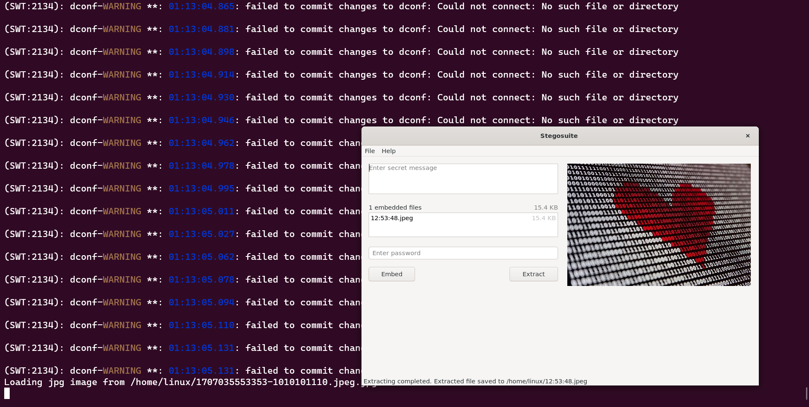
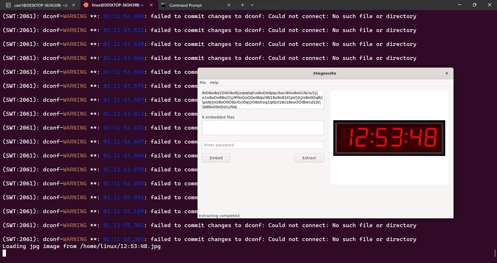
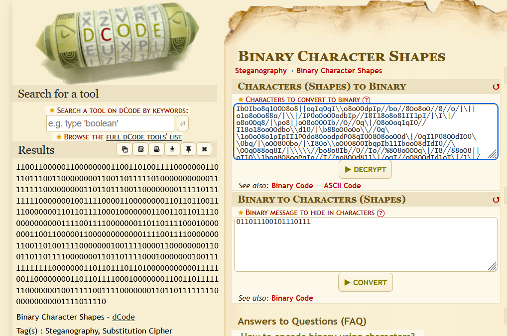
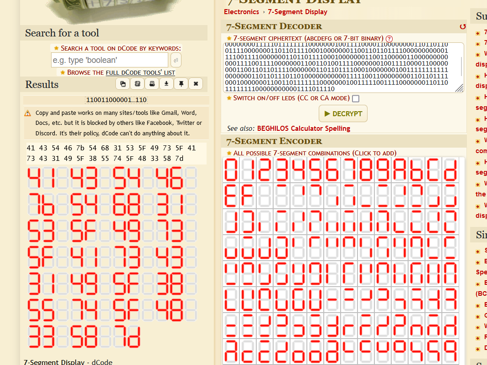
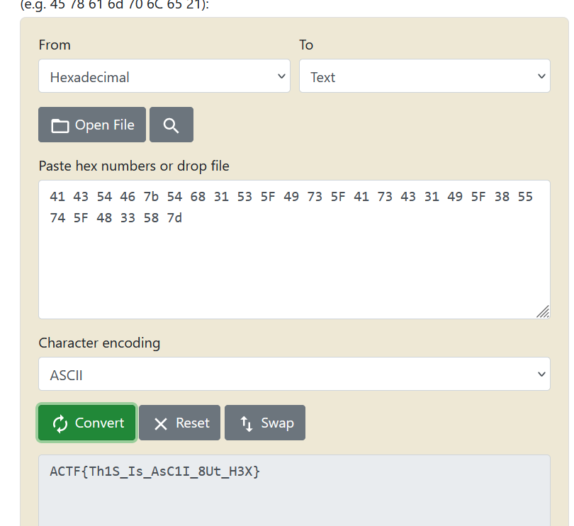

# Septet Doctor (250)

Category - Crypto

Challenge Question

I wish someone would gift me a binary clock for valentines day

The Flag should be wrapped in ACTF{}

Hints
1) Think about the layers of an onion, each layer needs to be peeled back t reveal the next
2) File inside file? You always don't need a password to access different layers, you can do this with a tool !

# Solution

The image is a steg file, which needs a specific tool to open. It's called stegosuite. Use stegosuite, to open the image and extract the given image.

This gives a file `12:53:48.jpeg`. You need to stegosuite this image AGAIN. But stegosuite only takes jpg, so just change the file from .jpeg to .jpg and extract with stegosuite again.

You get this cipher text

`IbOIbo8q1O0O8o8||oqIq0qI\\o8oO0dpIp//bo//8Oo8oO//8//o/|\||o1o8oOo88o/|\\|/IP0oOoO0odbIp//I8I18o8o81II1pI/|\I\|/o8o0Oq8/|\po8||oO8oO0OIb//O//0q\|/O8oOoq1qI0//I18o18ooOOdbo\\d10/|\b88oO0oOo\\//0q\\1oOoO8o1pIpII1POdo8OoodpdPO8qI0O8O8ooOOd\|/0qI1P08OOdIO0\\0bq/|\oOO800bo/|\I80o\\oO008O0IbqpIb11IbooO8dIdI0//\\OOqO88oq8I/|\\\\\//bo8o8Ib//0//Io//%8O8oOOOq\|/I8//88oO8||oI1O\\1boq8O8oqPqIq//I//po8O0d811\|/oqI//oO8OOdId1oI\|/1\|/88oO8ooo1IIpI\|/o`

The given images represent binary and heart. The challenge question also refers to this in some manner. 

The first cipher is Binary character shapes cipher.

this gives us a lot of binary. The second cipher is the 7-Segment Display Cipher.

given hex conver to ascii you get the flag

`ACTF{Th1S_Is_AsC1I_8Ut_H3X}`