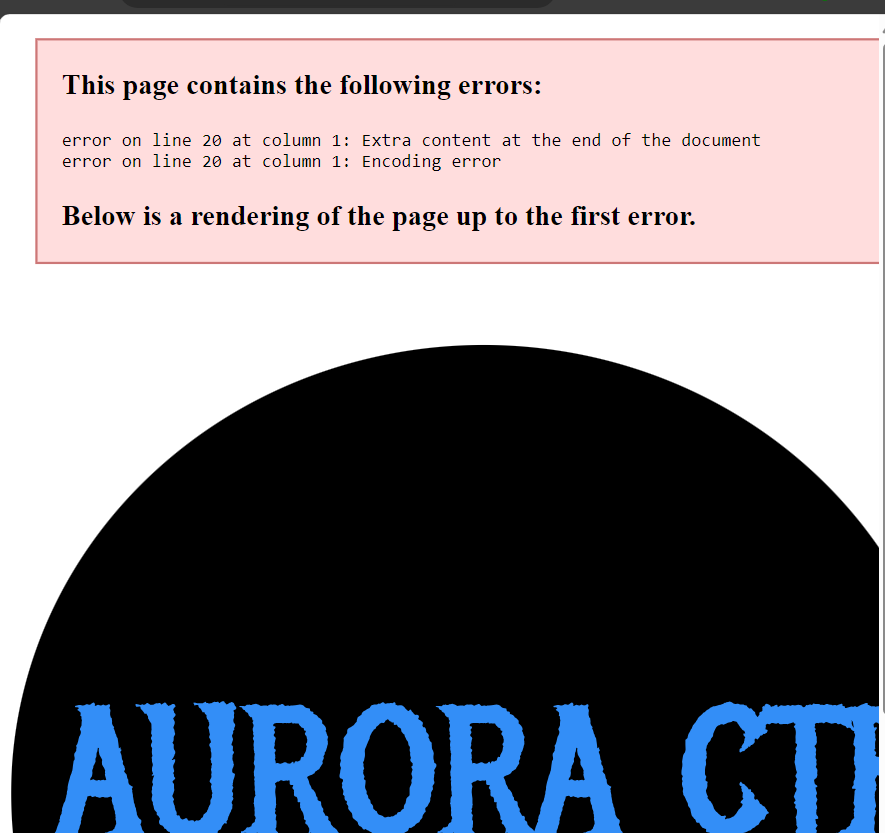
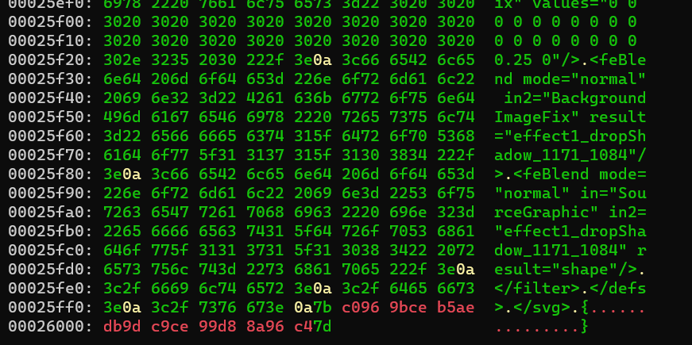
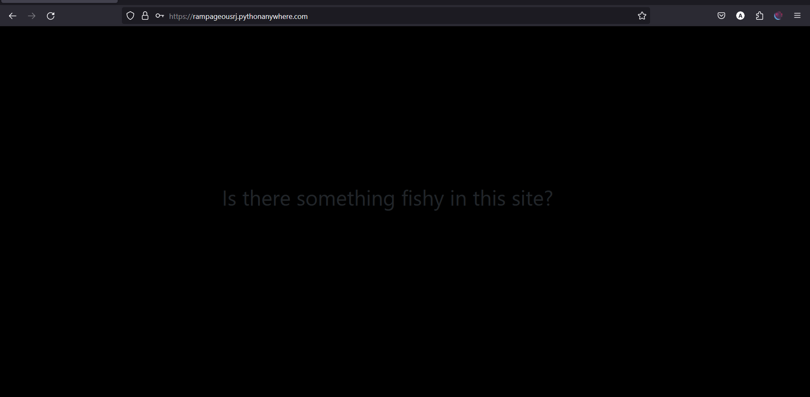
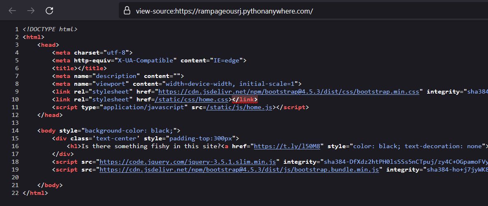
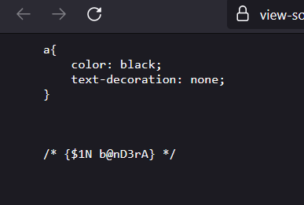
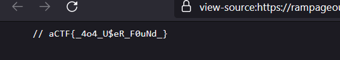

# Sherlock in Homes (150)

Category - Web

Challenge Question

I ought to remember my credentials but I do not. I only remember I changed my password 6 times

username : rampage

The Flag should be wrapped in aCTF{}

Link 1: https://rampageousrj.pythonanywhere.com/

Hints
1) Replace the $ in password with S

## Solution

we are given a function.py and a svg file. Open the svg file in edge it gives this error. 



the error tells there is some extra data in the svg. hexdump the svg.



the last bytes in the curly braces is important.

`c0969bceb5aedb9dc9ce99d88a96c4`

now analyzing function.py 

```python
for i in cipherText:
    if i in hex_arr:
        c = (hex_arr.index(i)+k)%16
        new_cipherText += hex_arr[c]
    else:
        new_cipherText += i
```

This shows this is some substitution cipher. we can reverse it easily if we just change the addition in this line `c = (hex_arr.index(i)+k)%16` to subtraction. For `k`, we can assume it from the challenge question as 6. Then the hex arr has length 16 so the array is all hex characters. now make a reverse script

```python
decryptedText = ""
hex_arr = "0123456789abcdef"
new_cipherText = "c0969bceb5aedb9dc9ce99d88a96c4"
k = 6

for i in new_cipherText:
    if i in hex_arr:
        c = (hex_arr.index(i)-k)%16
        decryptedText += hex_arr[c]
    else:
        decryptedText += i

print(bytes.fromhex(decryptedText).decode())
```

`j05h_Hu7ch3r$0n`

hint says to swap $ with S for some reason

`j05h_Hu7ch3rS0n`

Open the website with this password and username: rampage



red herring, there is an anchor that goes to rickroll

go to page source



open both the static css and js files




`aCTF{_4o4_U$eR_F0uNd_}`
