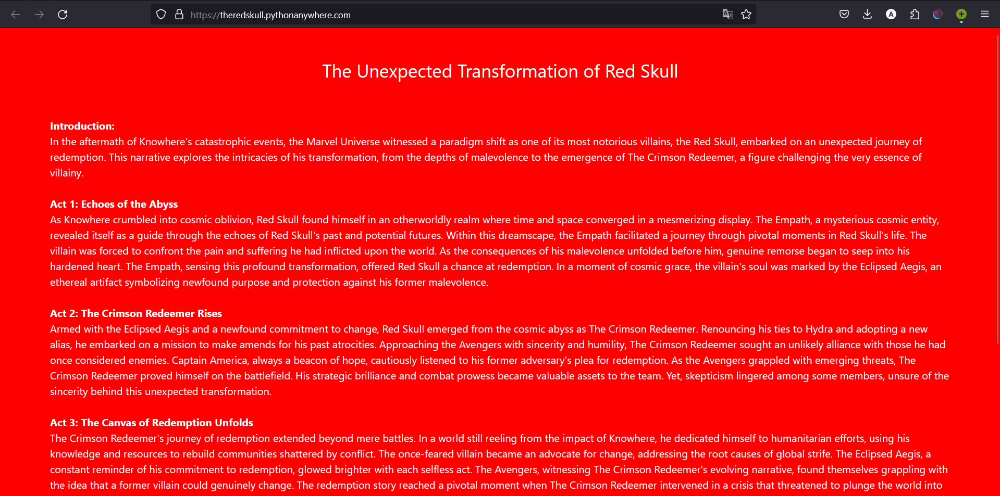

# The Crimson Avenger (50)

Category - Web

Challenge Question

Time. Space. Reality. It's more than a linear path. It's a prism of endless possibility, where a single choice can branch out into infinite realities, creating alternate worlds from the ones you know.

I am the Watcher.

I am your guide through these vast new realities.

Follow me and ponder the question... "What if?"

The Flag should be wrapped in aCTF{}

Link 1: https://theredskull.pythonanywhere.com/

Hints
1) Probe the unseen depths of HTTP Headers.

## Solution

Open the website it's a whole aaah story.

As mostly signifies red **SKULL**, we can try to send a HEAD request to the website (i got this after the hint also). Go into burpsuite, send the request to repeater and change from GET to HEAD

`aCTF{R3d_D3@d_r3D3m7t10n}`