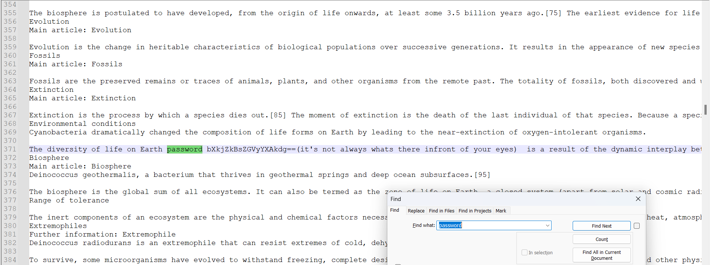

# Xclusiv3ly For Y0u (150)

Category - Crypto

Challenge Question

Oh no! My password got corrupted, can you please retrieve it for me?

The Flag should be wrapped in aCTF{}

Hints
1) It is Xclusive for a reason
2) Explore the secrets Hidden within Vim's Editor.

## Solution

Given a data.txt and java file. First running the `file` command on it gives:

```
└─$ file not_choosen.java
not_choosen.java: Vim encrypted file data with blowfish2 cryptmethod
```

So opening the file in vim will ask for a password. Searching password in the given data.txt you find there is a base64 line 



base64 decode that, you get the password `my#f@lderap$v`, open it in vim with the password you get the java code. Now opening in vim is easy but I still don't know how to copy paste out of vim in wsl (life) so i just used this tool called [vimdecrypt](https://github.com/gertjanvanzwieten/vimdecrypt) to get the stuff out.

```java
import java.util.*;import java.util.*;

class not_taken {
    public static void main(String args[]) {
        not_taken ob = new not_taken();
        Scanner in = new Scanner(System.in);
        System.out.println("Enter the flag");
        String input = in.next();
        if (ob.match(input)) {
            System.out.println("Correct Flag entered!");
        } else {
            System.out.println("Incorrect Flag entered! Try Again");
        }
    }

    public String hexencode(byte[] input) {
        StringBuilder result = new StringBuilder();
        for (byte b : input) {
            result.append(String.format("%02X", b));
        }
        return result.toString();
    }

    boolean match(String password) {
        byte[] pws = password.getBytes();
        byte[] key = "w3__ar3_mi5t_is_key".getBytes();

        if (key.length != pws.length)
            return false;

        byte[] Xored = new byte[key.length];
        for (int i = 0; i < key.length; i++)
            Xored[i] = (byte) (key[i] ^ pws[i]);

        String hexencoded = hexencode(Xored);
        System.out.println(hexencoded);

        String expectedHex = "16502B07091C6F183615442A0717005A1104";

        return hexencoded.equals(expectedHex);
   }
}
```

this is a normal xor cipher. We have everything so xor em.

```python
from Crypto.Util.strxor import strxor
expected = bytes.fromhex("16502B07091C6F183615442A0717005A1104")
key = b"w3__ar3_mi5t_is_key"
print(strxor(expected, key[:len(expected)]))

# b'actXhn\\G[|q^X~s\x05za'
```

this doesn't give good output. If we look in the bytes, everything goes wrong from 4th byte so let's remove the underscore. 

```python
from Crypto.Util.strxor import strxor
expected = bytes.fromhex("16502B07091C6F183615442A0717005A1104")
key = b"w3_ar3_mi5t_is_key"
print(strxor(expected, key[:len(expected)]))
# b'actf{/0u_ 0und_1t}'
```

now ig change the characters that aren't readable. change the numbers to letters.

```python
from Crypto.Util.strxor import strxor
expected = bytes.fromhex("16502B07091C6F183615442A0717005A1104")
key = b"w3_are_mist_is_key"
print(strxor(expected, key[:len(expected)]))
# b'actf{y0u_f0und_1t}
```

`actf{y0u_f0und_1t}`