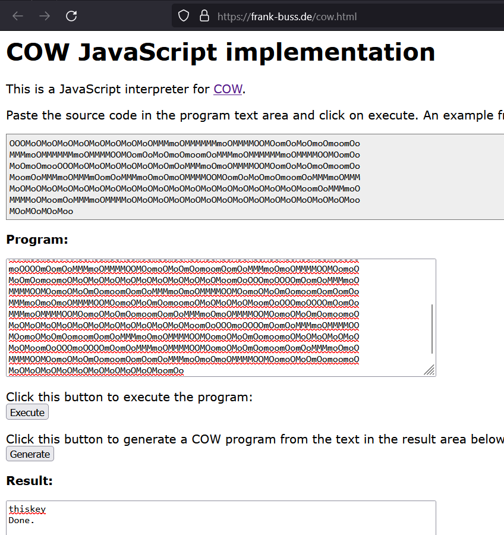

# Young McDonald's Farm (150)

Category - Crypto

Challenge Question

If it isn't advanced, I don't want it.

The Flag should be wrapped in aCTF{}

## Solution

Given text.txt, we have a cipher and key divided into two parts.

The first part is actually a esoteric programming language called COW. You can run it online [here](https://frank-buss.de/cow.html)



`thiskey`

Second part is a text that you keep on base64 decode until you get readable text

```python
In [1]: from base64 import b64decode

In [2]: key = "WVZoTmVFMXFhR2xoV0ZKNg==".encode()

In [3]: b64decode(key)
Out[3]: b'YVhNeE1qaGlhWFJ6'

In [4]: b64decode(b'YVhNeE1qaGlhWFJ6')
Out[4]: b'aXMxMjhiaXRz'

In [5]: b64decode(b'aXMxMjhiaXRz')
Out[5]: b'is128bits'
```

`is128bits`

Key: `thiskeyis128bits`

Now we take the cipher text, the challenge text talks about Advanced, put 2+2, this is about AES. Most simple ECB decipher.

```python
from Crypto.Cipher import AES
from base64 import b64decode

def decrypt(ciphertext, key):
    cipher = AES.new(key, AES.MODE_ECB)
    plaintext = cipher.decrypt(ciphertext)
    return plaintext.rstrip(b'\0').decode()

ciphertext = b64decode("fCYYDYUUmRT8QV9jxJ9br/aZxgJFKPIbYbUwUj1EZWs=")
key = b"thiskeyis128bits"

print(decrypt(ciphertext, key))
```
```
└─$ /usr/bin/python3 /home/user1/aurora/testing.py
Congrats_You_got_the_flag
```

`actf{Congrats_You_got_the_flag}`
